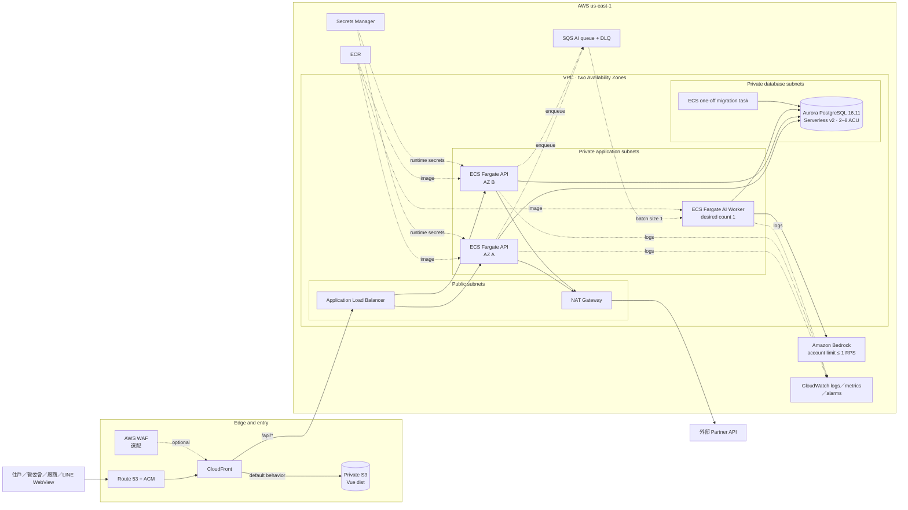

# AWS 正式部署架構

> 定案日期：2026-08-01  
> 目標區域：`us-east-1`  
> 視覺版：[aws-production-architecture.html](aws-production-architecture.html)

## 定案規格

| 層級 | 正式規格 | 第一階段 smoke deployment |
| --- | --- | --- |
| 前端 | 私有 S3 + CloudFront OAC | 相同 |
| API | ECS Fargate，2 tasks 跨 AZ | 1 task，先驗證容器與 ALB |
| AI | SQS + 單一 ECS worker | Bedrock 由 API task 直接呼叫，`us.anthropic.claude-sonnet-4-6` 已上線；SQS/DLQ 已建立，worker 待程式完成 |
| Database | Aurora PostgreSQL 16.11 Serverless v2，2–8 ACU | 能力已實測；應用 adapter 完成後才建立正式 cluster |
| Session | PostgreSQL JSONB `SessionStore` | 現況仍是 in-memory，不可水平擴展 |
| Upstream | Partner API 經 NAT；mock 獨立 container/service | 暫用同 task sidecars |
| Secrets | Secrets Manager + ECS task role | 先放非敏感 demo 設定；正式 token 再注入 |
| Observability | CloudWatch logs、ALB／ECS alarms | Logs + health check |

## 安全邊界

- S3 Block Public Access 全開，只允許指定 CloudFront distribution 經 OAC 讀取。
- ECS tasks 不配置 public IP；ALB security group 只接受 AWS-managed CloudFront origin-facing prefix list，listener 另要求部署時產生且一般更新沿用的 `X-Origin-Verify` header。header rotation 必須用 old/new 雙值的分階段流程，不可在一般更新中直接替換。
- Foundation 的 CloudFront→ALB origin leg 目前仍為 HTTP；處理正式 credentials 前，需以 custom origin hostname + ACM 將該段升級為 HTTPS。
- Aurora `PubliclyAccessible=false`，DB security group 只接受 ECS security group 的 TCP 5432。
- 憑證不進 image、Git 或 task definition 明文，正式值由 Secrets Manager 注入。
- 目前單一 API task 以 process lock 將 Bedrock 呼叫序列化並保留 1.1 秒間隔，符合帳號級 1 RPS；擴展到多 tasks 前必須改由單一 SQS worker 做帳號級協調。
- 正式資料不得包含競賽規範禁止的個資、財務、健康、付款或其他敏感資料。

## 部署閘門

第一階段只證明 AWS foundation 可運行，不宣稱資料層已完成。下列條件全部完成後才把 API desired count 調為 2 並接上正式 Aurora：

1. SQLite repositories 已替換為 PostgreSQL implementations。
2. `InMemorySessionStore` 已替換為 PostgreSQL JSONB store。
3. migrations 與 demo seed 已移出 FastAPI startup，改為一次性 ECS task。
4. localhost fake upstream 已明確部署為 sidecars 或獨立 services。
5. Bedrock queue worker 已實作 retry、DLQ 與 UI job status。
6. 跨 task、rolling deployment、故障重啟與端到端流程驗證通過。

## 事實來源

- [AWS CloudFront + S3／ALB reference pattern](https://docs.aws.amazon.com/whitepapers/latest/best-practices-wordpress/reference-architecture.html)
- [AWS CDK ECS Fargate example](https://docs.aws.amazon.com/cdk/v2/guide/ecs-example.html)
- [Aurora Serverless v2 operation](https://docs.aws.amazon.com/AmazonRDS/latest/AuroraUserGuide/aurora-serverless-v2.how-it-works.html)
- 本帳號 2026-08-01 實測：Aurora PostgreSQL 16.11 `db.serverless`、0.5–1 ACU 進入 `available`，測試資源後續已完整刪除。

Content was rephrased for compliance with licensing restrictions.
## 2026-08-01 foundation 部署結果

本次部署保留為後續正式化的 AWS foundation，而不是一次性測試環境：

| 項目 | 實際結果 |
| --- | --- |
| Region | `us-east-1` |
| Bootstrap stack | `aiwave-production-bootstrap` · `CREATE_COMPLETE` |
| Application stack | `aiwave-production-app` · `UPDATE_COMPLETE` |
| 使用者入口 | `https://d30aef3rrzkoy1.cloudfront.net` |
| ALB origin boundary | 公網直接連線已封鎖；只接受 CloudFront origin-facing 網路且需符合輪替 header |
| ECS | service `api`，desired/running `1/1`，deployment `COMPLETED` |
| Container health | `api`、`partner-fake`、`vendor-fake` 均為 `RUNNING`；兩個 sidecars 為 `HEALTHY`，ALB target `healthy` |
| Catalog | startup sync 已啟用；12 家 providers 均同步為 `partner-demo-v5`，upstream consistency `true` |
| AI | `LLM_PROVIDER=bedrock`；Claude Sonnet 4.6 intent 與 Agent live probes 均為 HTTP 200 |
| Frontend | Vue production build 已發布至私有 S3，CloudFront invalidation 已完成 |
| HTTP smoke | CloudFront `/`、`/today`、`/api/v1/services`、provider catalog、Bedrock intent 與 Agent stream 均回應 HTTP 200；ALB target health 為 `healthy` |
| Logs | 修正後目前 ECS task log stream 未發現 traceback／missing credentials／internal server error |
| Database | `DeployDatabase=false`；application stack 沒有 RDS／Secrets Manager 資源，區域內也沒有 DB cluster／instance |

### 保留與成本決策

- 保留 bootstrap 與 application stacks，因其為可持續迭代的正式 foundation；ECR image、私有 S3、CloudFront、VPC、NAT Gateway、ALB、ECS、SQS/DLQ 與 CloudWatch logs 會繼續存在。
- Aurora capability test 的 cluster、instance 與 subnet group 已刪除；目前沒有持續的資料庫成本。
- 啟用 Aurora 必須同時傳入 `--deploy-database --confirm-database-costs`，且 CloudFormation rule 也會拒絕未確認的直接部署；後續一般更新會保留既有 DB 狀態，不會因省略 flag 而要求刪除。cluster 啟用 deletion protection，停用條件或刪 stack 前必須先透過獨立、人工確認的 teardown 流程關閉 protection。
- 目前仍會產生 NAT Gateway、ALB、Fargate task、CloudFront／S3、ECR、CloudWatch 與 Bedrock token 使用費。若暫停展示，應刪除 application stack；bootstrap 的 ECR/S3 設為 `Retain`，刪 stack 前仍需另行決定資料保留方式。

### 此環境尚未等同完整正式上線

目前可公開展示 foundation 與單 task demo，但資料與 session 仍是 SQLite／in-memory。除前述部署閘門外，正式公開前仍需：

- 實作 PostgreSQL repositories、JSONB session store、migration task 與資料備份／還原演練，再以 `DeployDatabase=true` 建立 Aurora。
- 移除 runtime startup seed，將 fake upstream 改成明確的非正式整合依賴或串接正式 Partner API。
- 實作 ECS AI worker、SQS retry／DLQ consumption 與 job status；目前 Bedrock 已由單一 API task 直接呼叫，尚未具備跨 tasks 的帳號級 1 RPS 協調。
- 補上 Route 53、viewer／origin ACM TLS、WAF、CloudWatch alarms 與外部 synthetic monitoring；目前公開入口使用 CloudFront 預設網域，CloudFront→ALB 仍為受限 HTTP origin。
- 完成跨 task 測試後才把 desired count 從 1 調到 2，並執行安全、負載、rolling deployment 與 disaster recovery 驗證。
- 補齊公開 repo 所需的根目錄 `.kiro` 設定；目前 workspace 尚未建立該目錄。
