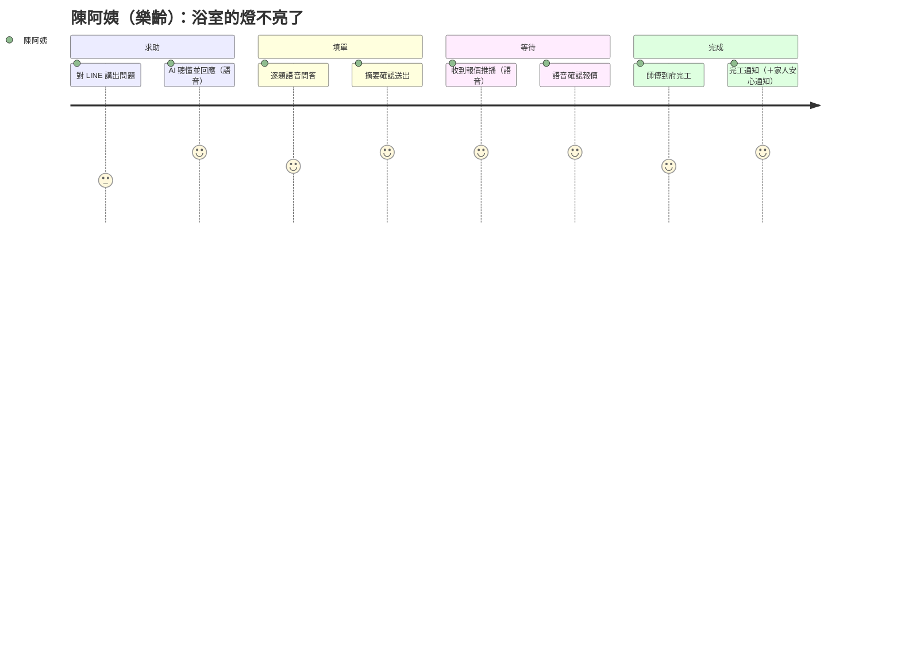
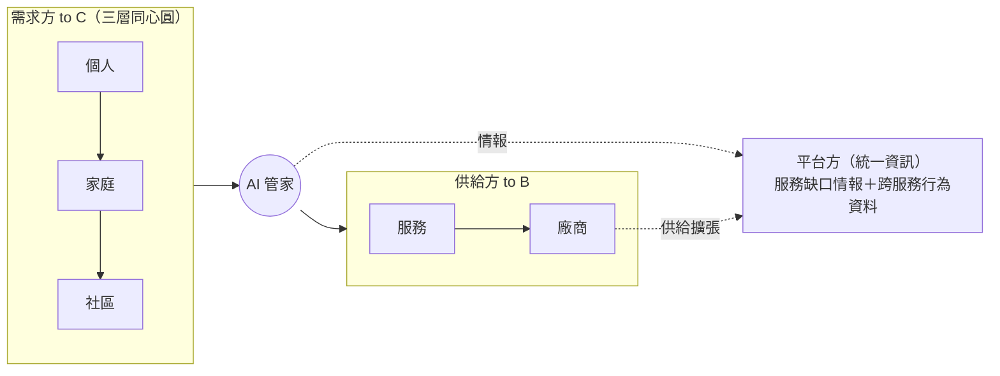

# 00・產品與情境

> 2026 雲湧智生黑客松・統一資訊命題（智慧零售）：**「AI 生活管家：智慧社區服務需求理解與媒合平台」**。本文是 PPT「情境＋使用者」與 Demo 影片的素材源頭。
> 詞彙見 [CONTEXT.md](../../CONTEXT.md)；正式需求見 [06 SRS](06-system-requirements.md)；決策見 [docs/adr/](../adr/)。
>
> **目前競賽版基線**：Web 為主要產品與 Demo 介面；Hero Demo 是 DUSKIN 社區冷氣聯合清洗，第二條主要展示線是個人的「今日生活中心」。服務目錄涵蓋 9 項可操作服務，其中 DUSKIN、黑貓、foodomo、EZTABLE、7-ELEVEN 做較深整合（[ADR-0010](../adr/0010-hero-personal-hub-and-service-breadth.md)）。下方其他情境保留為產品場景庫，不代表全部都要在主 Demo 逐段演出。

## 1. 定位

**一個 Web-first AI 生活服務平台，從個人日常延伸到社區集體——理解需求、產生彈性留資表單、媒合合適的服務商或商品。**

- **對齊官方核心三件事**：彈性留資表單（＝題組引擎）＋服務媒合（依服務類型/地區/時段/預算/緊急程度/範圍/評分）＋廠商後台。命題主題本身就是「智慧社區服務…媒合平台」，我們的社區定位正踩中主題。
- **雙重心**：個人日常 ＋ 社區集體，以「範圍（scope）」統合為單一管家（[ADR-0003](../adr/0003-scope-as-core-attribute.md)）。
- **錨定情境**：社區為主場景、樂齡為情感亮點 persona——一個 demo 同時吃到官方預設情境中的兩個。
- 命題三角色一對一覆蓋：

| 我們的角色 | 命題角色 | 入口 | 核心動作 |
| --- | --- | --- | --- |
| 住戶／消費者 | (i) 消費者 C 端 | Web 住戶工作區；LINE 延伸 | 今日生活中心、服務搜尋、預約、訂單、提醒與優惠 |
| 社區管理者 | (iii) 設計後台 | Web 社區營運工作區 | 聯合預約、團購、推播、活動企劃與成效分析 |
| 合作廠商 | (ii) 合作廠商 B 端 | Web `/vendor` | 接諮詢單、報價、更新進度、AI 回覆草稿、自助上架 |
| 平台方 | 服務整合方 | Web 平台整合中心 | 服務目錄、廠商接入、契約測試與服務缺口分析 |

## 2. Persona × 4

| # | Persona | 背景 | 代表需求 | 對應 demo 捆包 |
| --- | --- | --- | --- | --- |
| P1 | 陳阿姨，68 歲 | 樂齡、獨居、不擅打字，LINE 是唯一會用的 App | 東西壞了有人修、不想看密密麻麻的字 | A |
| P2 | 林先生一家，35–40 歲 | 雙薪家庭、時間碎片化 | 一句話交辦多件事、家人共享提醒與代辦 | A／D |
| P3 | 小圓，26 歲 | 租屋上班族、7-11 重度使用者 | 主動補貨提醒、最划算折抵、趕時間時順路把事情辦完 | B／C |
| P4 | 張主委，55 歲 | 社區管理者 | 開團不要用 Excel 收單催單 | D |

**體驗承諾**：P1 全程語音完成一張諮詢單、回覆也用語音唸；P2 一句話拆多任務各自回報、女兒能遠端代辦並收到安心通知；P3 系統依行為主動提醒並預填「確認即執行」卡片；P4 三分鐘開團、AI 文案招團、截止零手工結單。

## 3. Hero Demo、個人展示線與場景庫

### 競賽版主要展示

| 層級 | 敘事 | 走過的能力 |
| --- | --- | --- |
| **Hero・DUSKIN 社區冷氣聯合清洗** | 社區發起聯合清洗 → AI 建表單與彙整需求 → 住戶選時段 → 媒合/報價 → DUSKIN 接單履約 → 社區查看成效 | 題組引擎、社區需求聚合、合作廠商接入、報價、訂單、通知、營運分析 |
| **第二主線・今日生活中心** | 個人登入後看見行為推導的建議、本月消費、點數優惠、提醒、9 項服務入口與跨服務訂單進度 | 行為指紋/軌跡、推薦、點數計算、提醒、服務目錄、統一訂單 |
| **平台證明** | 平台整合中心展示五條深度品牌服務與三種接入模式 | 統一服務契約、標準/轉接/工作台接入、服務缺口情報 |

### 延伸場景庫（不要求全部上鏡）

| 捆包 | 敘事 | 走過的能力 |
| --- | --- | --- |
| **A・樂齡＋家庭** | 陳阿姨語音報修 →（女兒遠端代辦確認報價）→ 完工，取貨/到家安心通知家人 | 語音進出、題組引擎、諮詢單落地、廠商報價、家庭群組代辦、事件推播 |
| **B・個人智慧** | 小圓：系統依行為軌跡主動提醒補貨/換季，推薦最划算折抵方案 | 行為指紋/軌跡、推薦、折扣試算、消費儀表板 |
| **C・超商生活任務** | 小圓趕高鐵：問答＋庫存/門市查詢＋順路任務，可執行者預填「確認即執行」卡片 | 超商問答、庫存/門市查詢、任務排序、確認即執行 |
| **D・社區集體** | 張主委開團 → AI 文案 → 住戶跟團／群組 +1 整理 → 結單 → 收款分帳 → 到貨推播 | 管理者後台、AI 文案、團購生命週期、+1 解析、收款/分帳、批次推播 |

**加碼橋段**：現場把「公設預約」題組定義丟進系統，Agent 立刻支援新服務——「新增服務＝新增一份題組，零程式碼」（[ADR-0002](../adr/0002-shared-form-engine.md)）。

## 4. MOT（Moment of Truth）關鍵時刻

★＝決定性 MOT（做壞了整段體驗就毀）。

### 捆包 A・陳阿姨語音報修

| 階段 | 行為 | MOT | 體驗設計 | 系統支援 |
| --- | --- | --- | --- | --- |
| 求助 | 傳語音「浴室的燈不亮了」 | ★ **第一句話就被聽懂**——若要她「請選擇服務分類」，體驗即死 | 口語→服務模糊匹配；先複述理解再開始問 | STT、`search_services` |
| 填單 | 逐題回答 | 題數與口語化——超過 6 題或出現術語就放棄 | 已知資料不重問；一句話含多答案一次吃掉 | 題組引擎、跳題 |
| 確認 | 聽摘要說「對」 | ★ **敢不敢按下去**——長者最怕亂填被收錢 | 摘要唸清楚：項目/地址/時段/「現在不收費，報價後才決定」 | TTS、`submit_inquiry` |
| 等待 | 無所事事 | **主動**告知進度 | 報價推播含金額＋一句話即可確認 | 事件推播、`confirm_quote` |
| 完成 | 收完工通知 | 「處理好了」的安心；家人同步收到 | 完工推播＋安心通知家人＋下次可說「上次那個師傅」 | `status→80` 推播、家庭群組 |

### 捆包 D・張主委開團

| 階段 | 行為 | MOT | 體驗設計 | 系統支援 |
| --- | --- | --- | --- | --- |
| 開團 | 後台建「愛文芒果」 | 三分鐘完成，否則不如 Excel | 四欄位即可開團 | `create_group_buy` |
| 招團 | 產生推播 | ★ **AI 文案一鍵可用**——文案品質＝參與率 | 選條件→草稿→改寫→發送 | `generate_push_draft`、`send_push` |
| 收單 | 看進度、群組 +1 | +1/+2 自動變訂單 | 進度條＋倒數；群組訊息解析 | `parse_group_messages` |
| 結單 | 一鍵結單 | ★ **彙總零手工**——取代 Excel 的瞬間 | 採購單自動彙總，一鍵給廠商；未付款催收 | `close_group_buy`、收款/分帳 |
| 到貨 | 登記到貨 | 通知不用一個個貼 | 批次推播取貨資訊 | `mark_arrived` 批次推播 |

### 捆包 B/C 關鍵時刻（摘要）

- **B 個人智慧**：★ 推薦要「說得出理由」——「你上次 3 月清冷氣，快換季了」比無腦推薦更可信（`get_behavior_summary`→`get_recommendations`）；折扣試算要算出**真數字**（`calc_discount`）。
- **C 超商生活任務**：★ 多意圖與順序不能漏；可執行動作**預填就緒、使用者確認可微調才執行**（如叫車帶好時間地點），純實體任務（買早餐）轉提醒。

### MOT → 開發優先級推論

1. 決定性 ★ 集中在：**口語理解、確認體驗、AI 文案、結單彙總、推薦要有理由、確認即執行**——優先於任何加分功能。
2. 「等待階段的主動推播」貫穿多條捆包——事件推播是體驗骨幹，非加分項。
3. 語音唸摘要是樂齡信任關鍵——TTS 文案要專門寫，不能直接唸 JSON。

## 5. Demo 腳本骨架（5 分鐘）

> 主角是使用者，技術只在最後露臉。以 Web 畫面連續切換角色工作區，LINE 僅在通知延伸時補充。

| 時間 | 段落 | 畫面 | 風險備案 |
| --- | --- | --- | --- |
| 0:00–0:35 | 生態入口 | Web 首頁：今日生活中心＋9 項服務，不是單一冷氣網站 | 預灌個人資料 |
| 0:35–1:25 | 個人智慧 | 解釋推薦理由、查看點數優惠最佳組合、提醒與跨服務訂單 | 固定 persona 與可重算資料 |
| 1:25–3:15 | Hero | 社區發起 DUSKIN 冷氣聯合清洗，住戶完成動態表單與時段確認 | 預灌部分住戶需求 |
| 3:15–4:10 | 合作廠商 | DUSKIN 工作區接單、報價/確認、更新履約狀態 | 事件通知即時呈現 |
| 4:10–4:45 | 平台整合 | 五條品牌服務、三種接入模式、統一契約測試 | 接入健康狀態預灌 |
| 4:45–5:00 | 延伸通路 | LINE 通知與 MCP/Lumine one 延伸能力 | 預錄或靜態畫面備援 |

**開場白**：「清潔一個 App、修繕一個電話、團購一張 Excel。對 68 歲的陳阿姨太難了——但她會用 LINE。」

**錄製注意**：推播用真機鎖屏通知最有感；語音對話開字幕；後台先切好假登入不入鏡；每捆包各錄獨立片段再剪。

## 6. 商業敘事（PPT 用）

- **飛輪**：需求方越活躍 → 服務缺口情報越準 → 越知道該招什麼廠商 → 廠商越多 → 需求方越滿意。to C 是入口與黏著、to B 是收入、**平台拿到的「服務缺口清單」與「跨服務行為資料」才是統一資訊真正的資產**。
- **通路故事**：統一資訊是統一超商持股 86% 子公司，支援 7,100+ 家 7-ELEVEN。社區是 12,000+ 家生活服務的新分發通路——**一次簽一個社區＝一次獲客數百戶**；團購取貨綁 7-ELEVEN 門市／社區管理室，接回集團零售生態系。
- **樂齡趨勢**：語音互動對應台灣超高齡社會。

## 7. 評分對應

| 項目 | 配分 | 打法 |
| --- | --- | --- |
| 創意度 | 15% | 雙重心 scope 統合、樂齡全語音、社區團購生命週期、「零程式碼加服務」 |
| 技術可行性 | 25% | 厚 MCP（6 server，可掛 Lumine one）＋題組引擎＋地端優先可移植 AWS |
| 商業應用性 | 25% | 服務缺口飛輪＋社區新通路＋團購綁 7-ELEVEN，扣連集團生態系 |
| 主題切合度 | 20% | 三角色一對一對應；諮詢單彈性題組做成招牌 |
| 完成度 | 15% | P0 核心閉環 end-to-end（見 [06 SRS §6.1](06-system-requirements.md)） |
| Kiro 加分 | +5% | 以 Kiro 輔助開發並於簡報展示 |
