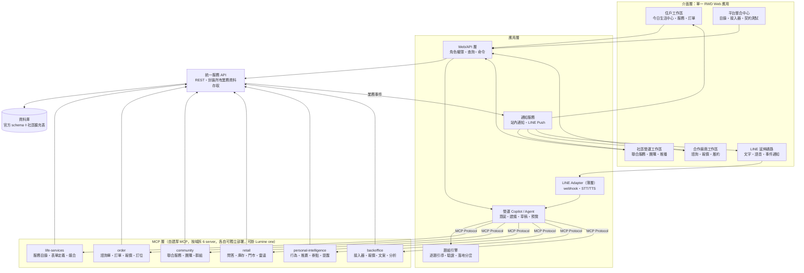
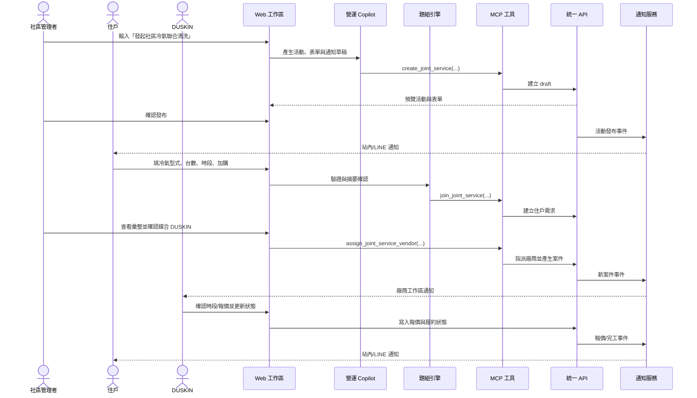
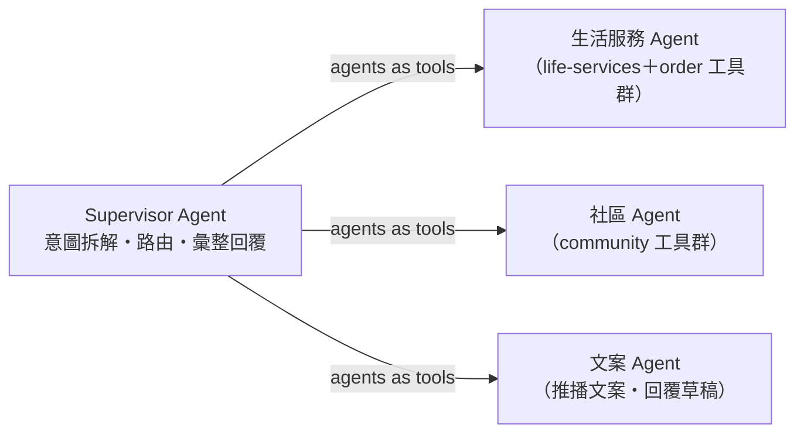

# 01・系統架構

> 決策依據：單一 RWD Web 應用是主要產品與 Demo 介面，LINE 是共用後端能力的延伸通路；AI 依工作區角色權限提供建議與經確認的操作；MCP 能力可供本系統與 Lumine one 使用。

## 分層架構（邏輯視圖）



要點：

1. **Web 工作區是主要介面**——一般查詢與確定性操作直接呼叫統一服務 API；需要理解、生成或編排時才呼叫營運 Copilot。
2. **LINE 與介面解耦**——LINE 是薄 Adapter，訊息統一為 `{user, text, media[]}`，語音在 Adapter 層轉為文字後使用相同 Agent 與 API。預設由 Bot 依意圖回傳 Web 深層連結，使用者點擊後進入同一套 RWD 流程；LIFF 是選配增強層，不是 Web 主流程的前置條件。
3. **MCP 層是繳交要求**——工具以標準 MCP Server 形式提供，我們自己的 Agent 與官方 Lumine one 的 Agent 都能掛載。
4. **六個工具域**是能力邊界；競賽版先採單一 Agent，不為展示多 Agent 而增加複雜度。
5. **寫入需確認**——AI 先產生草稿或預覽，發送、報價、上架與下單沿用角色權限並由人確認。

## 訊息時序（Hero：DUSKIN 社區冷氣聯合清洗）



## 地端優先、可移植（[ADR-0004](../adr/0004-local-first-aws-portable.md)）

先在地端開發，之後移植 AWS serverless。AWS 相依（LLM／STT-TTS／事件／物件儲存）一律藏於介面之後，執行單元容器化，DB 用 Postgres 相容。6 個 MCP server 本就是獨立可部署單元，移植時各自對應一個 Lambda／容器。本地→AWS 對照見 ADR-0004。「為什麼這樣設計」的簡報答法：以介面隔離換取地端快速開發＋雲端無痛部署，serverless 對應社區/個人流量的尖離峰與成本。AWS 細節（DB／runtime／Gateway／推播排程）另一輪定案後補於本頁。

## 技術棧（已定案）

| 層 | 選型 | 備註 |
| --- | --- | --- |
| MCP／Agent／API 核心 | **Python** | 官方 MCP 範例有 Python；Bedrock/RAG 生態成熟 |
| Agent 框架 | **Strands Agents** | AWS 自家、MCP 原生、地端可跑；升多 Agent 用 agents-as-tools |
| MCP Server | **FastMCP**（Python） | 6 個 server，各自獨立行程／可部署單元 |
| LLM | **Amazon Bedrock（Claude）** | 藏於 `LlmClient` 介面；地端可直連或改 Anthropic API |
| LINE | **line-bot-sdk**（Python） | webhook＋語音訊息下載 |
| 語音 | 地端 Whisper→雲端 **Transcribe/Polly** | 藏於 `SpeechClient` 介面 |
| DB | **PostgreSQL**→Aurora | 官方 DDL 直接匯入；純 SQL/ORM 不用專屬語法 |
| 前端 | **Vue 3 + Vite**（SPA） | Composition API＋SFC；住戶／社區／廠商／平台四工作區；靜態部署 S3/CloudFront；從共用元件層落實 RWD 與 WCAG 2.2 AA |
| 容器 | **Docker**＋docker-compose（地端） | 每單元容器化，對應 Lambda/Fargate |
| 開發輔助 | **Kiro** | 評分加分 |

## Repo 結構（monorepo，暫定；服務層待定後微調）

```text
/
├── core/          # 共享 domain＋資料存取（over DB）＋介面抽象
│   ├── domain/    #   業務邏輯：訂單/題組/媒合/團購/點數…
│   ├── data/      #   repository（Postgres）、schema、migrations
│   └── clients/   #   LlmClient / SpeechClient / EventBus / BlobStore（介面＋地端實作）
├── mcp/           # 6 個 MCP server（各子目錄，import core）
│   ├── life_services/  order/  community/
│   └── retail/  personal_intelligence/  backoffice/
├── agent/         # Strands 單一 Agent
│   ├── channels/  #   line / web 通路 adapter（薄層）
│   ├── intent/    #   意圖辨識・多意圖拆解
│   ├── forms/     #   題組引擎逐題對話迴圈
│   └── memory/    #   對話記憶
├── api/           # 薄 REST（給 web 後台，import core）
├── web/           # Vue 3 RWD SPA（resident / community / vendor / platform）
├── db/            # 官方 DDL＋擴充 seed scripts
├── infra/         # docker-compose（地端）、AWS（之後）
└── docs/
```

要點：`core/` 是唯一碰 DB 的地方，MCP／api 都 import 它（呼應「服務層＝共享核心」的傾向，但服務層最終形態待定後微調）；`core/clients/` 就是 ADR-0004 的介面隔離所在。

## 多 Agent 升級版（可能不採用；視餘裕）



升級條件：單一 Agent 版三條主線全部 end-to-end 通過後才動工。工具分群不變，只是掛載位置從單一 Agent 改為各子 Agent。

## AWS 部署（placeholder，另議）

已定案：**全 serverless**。待議清單：

- [ ] 資料庫選型（Aurora Serverless v2 Postgres／DynamoDB／RDS）
- [ ] Agent runtime（Lambda＋Strands／Bedrock AgentCore）
- [ ] LINE webhook 與 API 的 Gateway 拆分
- [ ] 推播排程（EventBridge）與語音（Transcribe／Polly）接線
- [ ] Web 前端託管（Amplify）與 CI/CD

定案後在此補上 AWS 架構圖（簡報必交付項目）。
