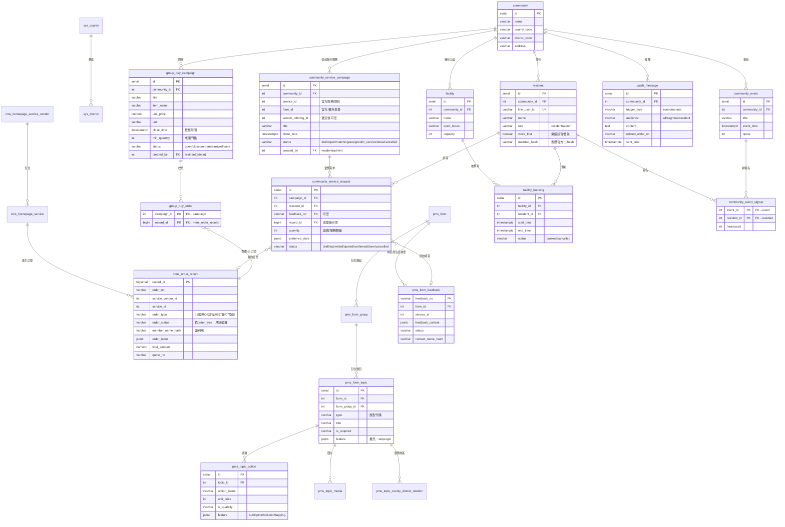
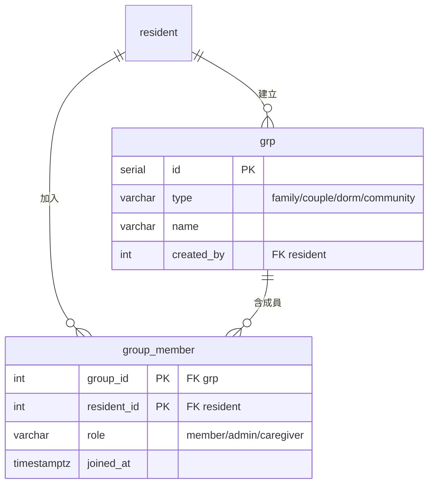
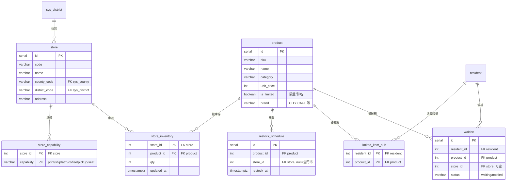
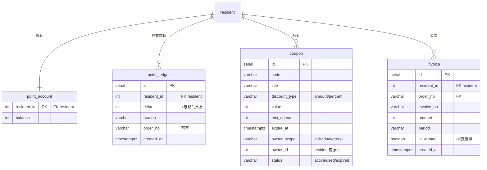
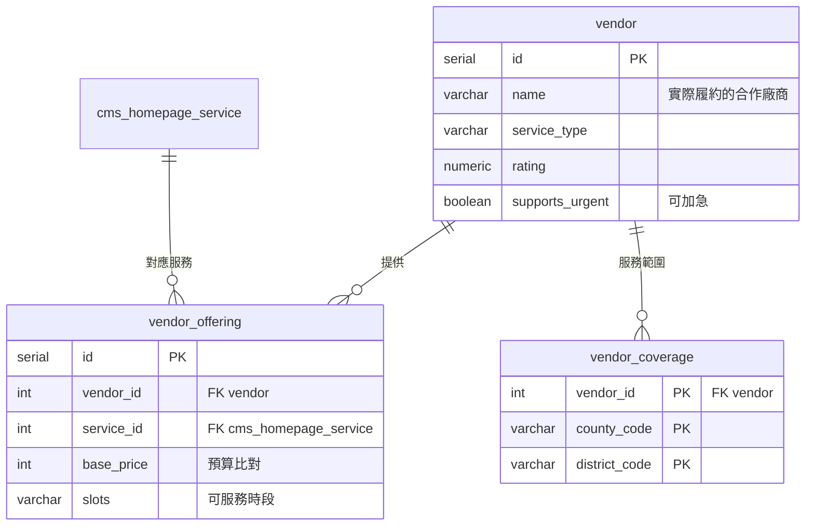
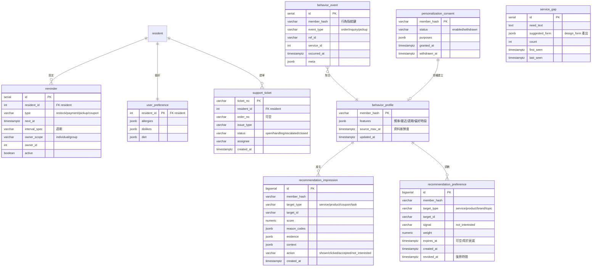

# 02・資料模型：ERD 與資料字典

> 原則：**官方表零修改**（DDL 直接沿用 [raw_data/](../../raw_data/) 的 .sql），所有擴充功能（社區/群組/零售/點數/廠商/個人智慧）一律用**擴充表**外掛；跳題等表單擴充利用官方既有的 `feature` JSONB 欄位（[ADR-0002](../adr/0002-shared-form-engine.md)）。
>
> 章節：官方表＋社區核心 ERD → 擴充 ERD（範圍/零售/點數/媒合/個人智慧）→ 訂單狀態機 → 官方表用法 → 個資 → 字典 → 種子計畫。

## ERD



## 擴充 ERD（範圍／零售／點數／媒合／個人智慧）

> 官方表零修改；以下全為自建擴充表。帶 `owner_scope` 的表用同一套範圍機制（[ADR-0003](../adr/0003-scope-as-core-attribute.md)）。

### 範圍與群組



**owner_scope 模式**：凡共享型實體（`coupon`、`reminder`，概念上還有生活任務）都帶兩欄——`owner_scope`∈{individual, group}、`owner_id`（individual 指 `resident.id`，group 指 `grp.id`）。查「我的東西」＝ `owner_scope=individual AND owner_id=我` ∪ `owner_scope=group AND owner_id∈我所屬群組`。存取一律經 `core/` 封裝，不各自 join。

- 表名用 `grp`（`group` 是 SQL 保留字，建表時加引號 `"group"` 或用 `grp`）。
- 社區管理者＝該社區 community 群組中 `role=admin` 的成員；代辦家人＝family 群組中 `role=caregiver`。`resident.role` 僅留作「本社區身分」快捷旗標供假登入。

### 零售層（超商生態，種子 ~15 門市 × ~40 SKU）



### 點數與優惠（中度真帳本；發票展示層）



### 廠商與媒合（FR-S-04，官方核心 P0）



媒合輸入＝官方明列條件：服務類型（`service_type`）、地區（`vendor_coverage`）、時段（`slots`）、預算（`base_price`）、緊急程度（`supports_urgent`）、評分（`rating`）。

`cms_homepage_service_vendor` 雖沿用官方實體名稱，但其中的「清潔、寄件、餐廳訂位、商城購物、修繕服務、美食外送」是**官方服務來源**，不是實際履約公司。真正的合作廠商存於擴充表 `vendor`，並以 `vendor_offering` 映射到官方 `cms_homepage_service`；官方表零修改（[ADR-0009](../adr/0009-separate-official-service-source-and-partner-vendor.md)）。

### 個人智慧＋平台情報＋客服



- **行為指紋 vs 軌跡**：`behavior_event.member_hash` 是身分解析鍵（行為指紋）；同一 hash 依 `occurred_at` 排序即行為軌跡。`behavior_event` 由官方訂單＋我方事件物化而來，`get_behavior_summary` 讀它。
- **行為特徵與推薦**：`behavior_profile` 從 `behavior_event` 聚合、可隨時重算；候選項目依最近性、頻率、週期、情境、偏好、推薦回饋與優惠效益計分。`recommendation_impression` 保存顯示分數與證據，`recommendation_preference` 保存「不感興趣」及復原訊號；LLM 只能依既有證據生成說明（[ADR-0011](../adr/0011-explainable-hybrid-recommendation.md)）。
- **個人化與隔離**：`personalization_consent` 未啟用或已撤回時不得建立/更新行為特徵。聊天長期只留抽取後的結構化意圖事件；社區分析以聚合資料輸出，家庭資料依 owner scope 與本人授權存取（[ADR-0012](../adr/0012-consented-minimal-personalization-data.md)）。
- **service_gap** 是「AI 設計新表單」（FR-S-03）累積的服務缺口，也是給平台方 P 的商業情報。

## 訂單狀態機（官方定義，依 order_type 而異）

order_type 官方碼：`01` 服務訂單、`02` 訂位、`03` 預約、`04` 其他、`05` 商品訂單、`06` 訂餐；**實際資料中商城購物用 `07`**（README.pdf 圖例未列但資料以 07 為準，團購沿用 07，見 [ADR-0001](../adr/0001-groupbuy-per-household-orders.md)）。

```text
01 服務訂單（修繕/清潔）：
  11 待訂金支付 → 12 已付訂金待報價 → 13 已報價待客戶同意
  → 14 客戶同意報價 → 15 已驗收待尾款 → 80 已完成
  （分岔）90 已取消 / 98 部分退款 / 99 已退款

02 訂位：
  01 待付款 → 02 待確認 → 03 已確認 → 04 進行中
  → 70 已完成(預定時間後3h) → 80 已完成(7天後核銷)
  （分岔）90 已取消 / 99 已退款

03 預約 / 04 其他 / 05 商品 / 06 訂餐 / 07 商城：
  01 待付款 → 02 待確認 → 03 已確認 → 04 進行中 → 80 已完成
  （分岔）90 已取消 / 99 已退款
```

- 報價流程（quote_no、13→14）只發生在 order_type 01 的估價類服務。
- 點數：`point_status` 01 待發放→02 已發放（`complete_time` 後），退款則 04 已取消。
- 個資：`member_*`／`contact_*` 為 AES-256-GCM 加密 bytea，一律以 `*_hash`（SHA-256）識別；ID 用 UUID v7。

## 官方表使用方式

| 表 | 我們怎麼用 | 備註 |
| --- | --- | --- |
| `mms_order_record` | 所有訂單（修繕 01、訂位 02、訂餐 06、跟團 07）的唯一事實來源 | JSON 與 CSV 是格式不同但內容相同的 99 筆，最大 record_id 為 2041 |
| `pms_form` / `pms_form_group` / `pms_form_topic` / `pms_topic_option` | 題組引擎的表單定義來源 | 跳題設定放 `pms_form_topic.feature.skipLogic` |
| `pms_form_feedback` | 修繕／清潔諮詢單的落地目標 | `feedback_content` 沿用官方 answerList JSON 格式 |
| `pms_topic_media` / `pms_topic_county_district_relation` | 題目圖片、服務地區限制 | 地區限制用於「這區沒服務」的引導回覆 |
| `sys_county` / `sys_district` | 地區代碼解碼 | 官方範例含 22 縣市、200 行政區；行政區只涵蓋其中 14 縣市，不是全量 |
| `cms_homepage_service_vendor` / `cms_homepage_service` | 官方服務來源與服務項目 | 來自 `相關主檔設定.json`，需自行建 DDL；前者不是實際合作廠商 |

官方範例的匯入層必須容忍並記錄以下資料品質問題：JSON 檔可能由多個頂層物件與說明文字串接而成；訂單實際使用 DDL 未列的 `order_type=07`；訂單引用主檔未提供的 `service_vendor_id=15`、`service_id=18`；表單範例則有缺少題組、跨表引用缺漏及唯一表單已停用且刪除等情形。原始資料保留不改，清洗後寫入 staging／正式表，Demo 缺口另以種子資料補足。

## 個資處理（模擬層簡化）

官方以 AES-256-GCM 加密個資欄位（bytea）並以 `*_hash` 識別同一人。**模擬環境簡化為：明文欄位＋照樣計算 `*_hash`**，Agent 與 MCP 工具一律只traffic hash 與必要顯示欄位；簡報註明正式環境沿用官方加密。

## 擴充表資料字典補充

- `resident.role`：`resident`（住戶）／`admin`（社區管理者）。合作廠商及其帳號使用自建 `vendor` 與廠商工作區身分，不對應官方 `cms_homepage_service_vendor`。
- `resident.voice_first`：樂齡標記；為真時回覆一律附 TTS 語音。
- `group_buy_campaign.status` 生命週期：`open`（收單中）→ `closed`（已結單，產出採購單）→ `ordered`（已向廠商下單）→ `arrived`（到貨，觸發取貨推播）→ `done`。
- `community_service_campaign` 是服務型聯合預約，不等同商品團購：它聚合住戶需求與時段、媒合 `vendor_offering`，每戶成單後仍各自連到官方 `mms_order_record`，以保留個人報價與履約狀態。
- `group_buy_order`：純關聯表，跟團明細（品項、數量、金額）都在 `mms_order_record.order_items`（JSONB，沿用官方商城購物格式：`item_id / item_name / unit_price / quantity`）。
- `push_message.trigger_type`：`event`（訂單事件自動觸發）／`manual`（管理者後台編寫發送，即個人化推播示範）。
- `grp` / `group_member`：承載家庭/情侶/宿舍/社區的共享；社區管理者與代辦家人是成員角色，不另立帳號表。
- `coupon` / `reminder` 的 `owner_scope`＋`owner_id`：個人或群組共享共用同一表（見上「owner_scope 模式」）。
- 零售層 `store` 綁 `sys_district`（NFR-08 一致性）；`store_inventory` 為門市×商品的庫存；`restock_schedule`＋`limited_item_sub` 支撐限量雷達，`waitlist` 支撐到貨候補。
- `point_ledger`：規則簡化但可真算（累點/折抵流水）；`invoice` 僅展示層（含 `is_winner` 中獎旗標，不做比對邏輯）。
- `vendor` 是實際履約的合作廠商；品牌優先採用官方素材中出現的統一企業集團或關係事業（例如冷氣清洗採 DUSKIN），不足處再以非競業合作廠商情境補足。官方資料未提供 API、報價、評分、時段與服務範圍，這些整合與營運資料由競賽系統建置；一個 `service_id` 對應 2-3 家 `vendor_offering` 供媒合比較。
- `behavior_event`：行為軌跡物化表，由官方訂單＋我方事件寫入，`member_hash` 為行為指紋鍵。
- `behavior_profile`／`recommendation_impression`／`recommendation_preference`：分別保存可重算特徵、推薦證據與「不感興趣」偏好訊號；硬性限制仍以 `user_preference` 優先排除，不把 LLM 文字當成推薦事實來源。

## Seed 資料計畫

官方範例訂單僅約百餘筆、且個人密集行為序列稀少，因此**種子資料一律以 script 自造補足**（官方允許，合理即可）；一支可重跑（idempotent）的 `db/seed.py`（Faker＋固定亂數種子）產生，`*_hash` 照 SHA-256 計算，與官方 schema 一致。

### Step 1 — 官方資料匯入
1. 建表：`縣市區域檔.sql` → `諮詢單相關table.sql` → `mms_order_record.sql`（FK 依賴序）；`cms_homepage_service(_vendor)` 需依 `相關主檔設定.json` 自建 DDL。
2. 匯入：官方地區範例、服務主檔、表單範例、99 筆官方訂單；保留來源與清洗紀錄。

### Step 2 — 社區與人（雙重心的「人」）
- 社區 1（幸福社區，綁某縣市/行政區）。
- 住戶約 12 名，含四個 demo persona：**P1 陳阿姨**（`voice_first=true`）、**P2 林先生＋配偶**（組 family 群組）、**P3 小圓**（個人智慧/超商主角）、**P4 張主委**（社區 admin）。
- 群組：1 個 family（林家，含 caregiver 代辦關係）、1 個 dorm 或 couple（示範 scope 擴充）。

### Step 3 — 社區營運資料
- 聯合服務活動 1 檔：DUSKIN 冷氣清洗，預灌部分住戶填答與時段，保留一戶供現場操作；活動可從 `open` 推進至 `assigned/in_service/done`。
- 公設 3 筆（交誼廳/健身房/KTV 室）＋少量既有預約。
- 團購活動 2 檔：1 檔 `open`（進行中，供 demo 跟團＋+1 整理）、1 檔 `arrived`（供 demo 到貨推播）；各含數筆跟團 07 訂單。
- 社區活動 1 筆。

### Step 4 — 超商零售層（~15 門市 × ~40 SKU）
- 門市 ~15：綁社區所在及鄰近 `sys_district`；每店 `store_capability`（列印/寄件/ATM/咖啡/取貨…不一）。
- 商品 ~40：含鮮食/飲料/CITY CAFE/日用，其中幾樣 `is_limited`（限量/聯名）。
- `store_inventory`：每店灌部分品項庫存（刻意留幾個門市缺貨，供「替代門市推薦」demo）。
- `restock_schedule` 幾筆、`limited_item_sub`／`waitlist` 各 1-2 筆（供限量雷達／到貨候補 demo）。

### Step 5 — 點數與優惠
- 每住戶 `point_account`＋數筆 `point_ledger`（由其訂單反推累點）。
- `coupon` ~10：含個人 scope 與 group scope、幾張即將到期（供優惠整合／折扣試算算出真數字）。
- `invoice` 展示數筆，其中 1 筆 `is_winner=true`。

### Step 6 — 廠商與媒合
- 每個核心 `service_type`（清潔/修繕/訂位…）建 2-3 家 `vendor`＋`vendor_offering`（不同報價/評分/時段）＋`vendor_coverage`（涵蓋社區所在區）；優先採用官方素材出現且服務確實相符的統一體系品牌，供 FR-S-04 媒合比較。

### Step 7 — 個人智慧種子（補官方資料稀疏）
- 為 **P3 小圓**灌一段連貫的種子訂單歷史→物化成 `behavior_event`（供行為軌跡→推薦/補貨提醒 demo）。
- `user_preference`：P1 設過敏/禁忌示範（供推薦過濾）。
- `reminder` 數筆（補貨/繳費/包裹），含 1 筆 group scope。
- `service_gap` 2-3 筆（供「AI 設計新表單」demo 有東西可展示）。
- `support_ticket` 1 筆（供異常/客服 demo）。

### Step 8 — 表單題組
- 三份題組定義：F1 修繕（官方範例擴寫）、F2 跟團、F3 公設預約（見 [03-form-engine.md](03-form-engine.md)）；跳題放 `pms_form_topic.feature.skipLogic`。

### 一致性要求（NFR-08）
門市屬於官方地區碼、商品價格合理、廠商服務範圍涵蓋社區所在區、行為軌跡與訂單一致、`*_hash` 與明文對得上。種子 script 用固定亂數種子確保每次重建結果一致，方便 demo 重跑。
