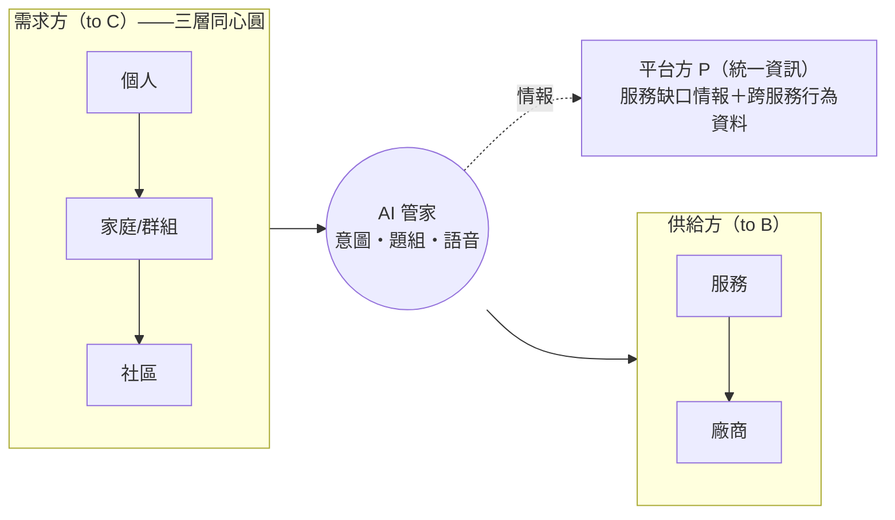

# 06・系統需求規格書（SRS）

> AI 生活服務平台。本文是功能與非功能需求的正式清冊，收錄所有已定案決策。需求逐條編號（FR-／NFR-），標注對象與優先級，供開發、簡報、驗收共同引用。
>
> **對象**：C 住戶/消費者・M 社區管理者・B 合作廠商・P 平台方（統一資訊）
> **優先級**：**P0** demo 核心（端到端做完並上鏡）／**P1** 完整實作但非主鏡／**P2** 架構支援、願景展示（不細做）
> 詞彙見 [CONTEXT.md](../../CONTEXT.md)，決策見 [docs/adr/](../adr/)。

## 1. 文件目的與範圍

### 1.1 目的
定義 AI 生活服務平台的完整需求基線。競賽版以單一 RWD Web 應用為主要產品與 Demo 介面，透過 AI 滿足個人、家庭、社區三個範圍的生活服務需求並串接合作廠商履約；LINE 為共用同一後端能力的延伸通路。

### 1.2 定位（已定案）
- **核心與基線**：會員是主要行為者；AI 從生活目標出發，跨點數、廠商與群組編排、確認及追蹤可執行生活任務（[ADR-0019](../adr/0019-member-first-life-task-orchestration.md)）。
- **主要展示**：以「爸媽週六要來」的一句多意圖需求，完成水電、清潔、點數試算、一次確認與履約追蹤（[07 Demo](07-demo-vertical-slice.md)）。
- **共用範圍**：個人使用 `individual`；家庭、情侶、宿舍與社區皆為 `group`，以 `group_type`、成員角色、active scope 及同意區分（[ADR-0003](../adr/0003-scope-as-core-attribute.md)）。
- 命題對應：官方三角色（消費者 C／設計後台 M／合作廠商 B）一對一覆蓋。

### 1.3 範圍分界
- **In scope**：個人／家庭／社區／服務／廠商五類功能需求（第 3 節）。
- **模擬邊界**：官方不提供實際 API 與廠商系統；統一服務契約、廠商接入器、超商零售資料（門市／商品／庫存／點數／優惠券）由本系統建置並維持內部一致，品牌優先採官方素材出現的統一體系業者。
- **Out of scope**：真實金流交易、真實第三方物流／叫車履約（以模擬 API 表示）。

## 2. 系統概述

### 2.1 角色與範圍軸

### 2.2 對外介面總覽
| 介面 | 使用者 | 說明 |
| --- | --- | --- |
| Web 會員端 | C | 首頁、點數兌換、全頁 AI、服務、會員中心、訂單與群組 |
| Web 群組管理能力 | C·M | 家庭／社區共同需求、代辦、通知、聯合服務與團購 |
| Web 合作廠商工作區 | B | 諮詢單、報價、訂單、履約與自助上架 |
| Web 平台整合中心 | P | 服務目錄、廠商接入、契約測試、服務缺口與整合健康度 |
| LINE 官方帳號 | C | 第二通路；文字、語音與事件通知，共用 Web 後端能力 |
| MCP Server | 平台 Agent | 自建、標準協定，可掛 Lumine one |

## 3. 功能需求

> 每條格式：`FR-{域}-{序}`｜需求｜對象｜優先級｜依賴/備註。域：P 個人、F 家庭、C 社區、S 服務、V 廠商、X 跨域。

### 3.0 跨域基礎（FR-X）★ 一切功能的地基

| ID | 需求 | 對象 | 優先 | 備註 |
| --- | --- | --- | --- | --- |
| FR-X-01 | 意圖判斷：依語境判斷需求、可拆解單則訊息中的多個意圖、生成建議方案 | C | **P0** | Agent 核心；多意圖＝一句話多任務 |
| FR-X-02 | 語音進＋語音出：LINE 語音訊息轉文字進 Agent；回覆附 TTS 語音 | C | P1 | LINE 延伸通路與樂齡體驗 |
| FR-X-03 | 題組引擎：讀表單定義、對話式逐題引導、條件跳題、驗證、落地分岔 | C·P | **P0** | [ADR-0002](../adr/0002-shared-form-engine.md) |
| FR-X-04 | 範圍與群組：核心實體帶 `owner_scope`；`group`/`group_member` 承載共享 | 全 | **P0** | [ADR-0003](../adr/0003-scope-as-core-attribute.md) |
| FR-X-05 | 行為指紋：以 `member_hash` 解析同一使用者的跨服務訂單/諮詢單 | C·P | **P0** | 身分解析；官方訂單範例約百餘筆，demo persona 另以種子資料補足 |
| FR-X-06 | 行為軌跡：由行為指紋建立跨時間行為序列 | C·P | **P0** | 今日生活中心推薦/提醒/儀表板的共同資料源 |
| FR-X-07 | 主動通知：訂單事件即時推播（報價/確認/完工/到貨/結單） | C·M | **P0** | 事件驅動 |
| FR-X-08 | 對話記憶：Session 內多輪脈絡、未完成填答續填 | C | **P0** | |

### 3.1 個人（FR-P）

#### 個人資料智慧
| ID | 需求 | 對象 | 優先 | 備註 |
| --- | --- | --- | --- | --- |
| FR-P-01 | 今日生活中心：整合本月消費、點數優惠、提醒、服務入口與跨服務訂單進度 | C | **P0** | 個人第二主要展示線 |
| FR-P-02 | 混合推薦：由行為特徵、對話意圖、情境與優惠條件計分，AI 協助理解/排序並以推薦依據說明理由 | C | **P0** | 不以 99 筆官方訂單宣稱訓練成熟 ML 模型；見 ADR-0011 |
| FR-P-03 | 點數計算機：OPENPOINT 點數×優惠券×支付，試算並建議折抵/累點策略 | C | **P0** | 規則簡化但必須可真算 |
| FR-P-04 | AI 線上點餐助手：統一鮮食、CITY CAFE、合作餐廳與外送服務共用選品、取餐/外送及優惠套用流程 | C | P1 | 真實交易以接入器模擬，寫入統一訂單 |
| FR-P-05 | 個人化控制：明確啟用/停用、對推薦選擇「不感興趣」與復原、管理硬性限制、清除特徵後重新建立 | C | **P0** | 不要求使用者管理底層特徵；見 ADR-0012 |

#### 提醒與優惠
| ID | 需求 | 對象 | 優先 | 備註 |
| --- | --- | --- | --- | --- |
| FR-P-10 | 補貨提醒：使用者設定補貨週期，到期提醒並推薦相關優惠 | C | **P0** | 今日生活中心提醒卡片 |
| FR-P-11 | 繳費/包裹領取/分享券領取提醒 | C | **P0** | 提醒引擎共用 |
| FR-P-12 | 限量商品搶購時點提醒 | C | P2 | 依賴商品上架排程 |
| FR-P-13 | 優惠整合：彙整可用券/點數/分享券/即將到期，依情境主動推薦 | C | **P0** | 與點數計算機共用帳本 |
| FR-P-14 | 折扣試算：當月折扣＋點數→最划算購買方案 | C | **P0** | 點數計算機的試算核心 |
| FR-P-15 | 支付與發票助手：支付方式、電子發票、發票中獎、消費紀錄 | C | P2 | 發票為展示層（清單＋中獎標記），不做比對邏輯 |

#### 情境推薦
| ID | 需求 | 對象 | 優先 | 備註 |
| --- | --- | --- | --- | --- |
| FR-P-20 | 過敏/禁忌設定：推薦時自動避開 | C | P1 | 偏好過濾器，成本極低 |
| FR-P-21 | 天氣情境推薦：雨/寒流/高溫→熱食/飲品/外送/防曬/補貨 | C | P1 | 命題明文提及 |
| FR-P-22 | 節日/季節任務：中秋/端午/母親節/開學季→購物/送禮/團購建議 | C | P1 | 節慶行事曆＝推播觸發條件 |
| FR-P-23 | 咖啡習慣助手：依購買時間/品項提醒預購/用券/補貨 | C | P2 | 行為軌跡特例 |
| FR-P-24 | 早餐/午餐預測推薦 | C | P2 | 需餐點資料 |
| FR-P-25 | 健康飲食助手：依熱量/偏好推薦鮮食/飲品/保健 | C | P2 | 需營養資料 |

#### 任務編排
| ID | 需求 | 對象 | 優先 | 備註 |
| --- | --- | --- | --- | --- |
| FR-P-30 | 生活任務：零散需求→有序任務組；可自動執行者由 AI 預填參數成「確認即執行」卡片（使用者可微調→確認才執行），純實體任務轉為提醒指引 | C | P1 | 「趕高鐵」情境；預填就緒＋逐項確認可微調 |
| FR-P-31 | 智慧購物清單：自然語言→購物清單＋通路/優惠券/替代品推薦 | C | P1 | |
| FR-P-32 | 順路任務規劃：依位置/時間/待辦排最順路的取貨/購物/繳費/列印 | C | P2 | 需地理/路線 |
| FR-P-33 | 旅遊/出遊管家 | C | P2 | 大量外部資料 |
| FR-P-34 | 活動前準備助手（演唱會/展覽/考試/校園） | C | P2 | 情境樣板 |
| FR-P-35 | 學生考試週/加班生存包：咖啡/宵夜/列印/提醒/團購整合 | C | P2 | 情境樣板 |

#### 超商生態（已定案「認真做」；需模擬門市×商品×庫存資料層）
| ID | 需求 | 對象 | 優先 | 備註 |
| --- | --- | --- | --- | --- |
| FR-P-40 | 問答功能：以自然語言回答旗下商店/支付/庫存/優惠/ibon 問題 | C | P1 | RAG＋策展知識庫 |
| FR-P-41 | 商品庫存查詢：特殊/限量/熱門商品在哪些門市有貨 | C | P1 | 需門市×商品×庫存 |
| FR-P-42 | 門市能力查詢：附近門市是否支援列印/寄件/ATM/取貨/咖啡/特定商品 | C | P1 | 需門市能力資料＋地理 |
| FR-P-43 | 替代門市推薦：指定門市缺貨/不支援時推薦鄰近可替代門市 | C | P1 | 依附 41/42 |
| FR-P-44 | 限量商品雷達：追蹤限量/聯名/熱門，上架/補貨/開賣前主動提醒 | C | P1 | 需商品上架排程 |
| FR-P-45 | 商品到貨候補：缺貨加入候補，到貨由 LINE 主動通知 | C | P1 | 需庫存狀態 |
| FR-P-46 | ibon 文件處理助手：上傳文件→判斷列印設定/份數/格式→ibon 操作提醒 | C | P2 | 與社區主軸弱相關 |
| FR-P-47 | 小賣家寄件助手：建立寄件資料、追蹤包裹、提醒買家取貨、整理交易 | C | P2 | 對象為小賣家 |

### 3.2 家庭／群組（FR-F）＊全部依賴 FR-X-04 範圍機制
| ID | 需求 | 對象 | 優先 | 備註 |
| --- | --- | --- | --- | --- |
| FR-F-01 | 群組共享：家庭/情侶/宿舍/社區群組共享優惠券/團購/提醒/生活任務 | C | **P0** | 本層前提；一張 group/group_member 表 |
| FR-F-02 | 長輩代辦：家人代長輩設定繳費/取貨/補貨/付款確認/生活提醒 | C | P1 | family 群組 caregiver 權限；樂齡補強 |
| FR-F-03 | 安心確認：長者/孩童/夜間完成取貨/叫車/到家後自動通知指定家人 | C | P1 | 重用推播，成本極低，情感強 |
| FR-F-04 | 分帳助手：多人共購/團購自動計算每人應付 | C | P1 | 純計算 |
| FR-F-05 | 優惠券交換/贈送媒合：即將到期/不常用券推薦分享給群組成員 | C | P2 | 依賴完整券系統 |

### 3.3 社區（FR-C）
| ID | 需求 | 對象 | 優先 | 備註 |
| --- | --- | --- | --- | --- |
| FR-C-01 | 團購：管理者設商品/結單時間/取貨資訊；住戶跟團；系統統計數量並通知廠商 | C·M | **P0** | 每戶一筆 07 訂單 [ADR-0001](../adr/0001-groupbuy-per-household-orders.md) |
| FR-C-02 | 社群訂單整理：LINE 群組 +1/+2/我要這個→正式訂單 | C·M | P1 | 純 LLM 解析，通路優勢無可取代 |
| FR-C-03 | 群組收款提醒：結單後整理付款狀態、催未付款成員 | M | P1 | 團購自然下一步 |
| FR-C-04 | 公設預約（交誼廳/健身房/KTV 室） | C·M | P1 | 「零程式碼加新服務」橋段 |
| FR-C-05 | 社區活動報名 | C·M | P2 | 選配 |
| FR-C-06 | 群組聯合服務：經成員同意後彙整需求與時段，媒合／通知合作廠商 | C·M·B | P1 | 可作 Hero 加碼；不取代會員個人任務主線 |

### 3.4 服務（FR-S）＊對話核心 FR-X-01~03 為前提
| ID | 需求 | 對象 | 優先 | 備註 |
| --- | --- | --- | --- | --- |
| FR-S-01 | 修繕/清潔履約：諮詢單→報價→確認→完工 | C·B | **P0** | 官方 pms_form_*＋mms_order_record |
| FR-S-02 | 餐廳訂位 | C | **P0** | 官方 order_type 02 |
| FR-S-03 | AI 設計新表單：需求無對應服務時，記錄需求並生成新表單；累積為服務缺口清單 | P·M | P1 | 題組引擎升級版；產出平台情報 |
| FR-S-04 | 服務媒合：依**服務類型/地區/時段/預算/緊急程度/服務商可服務範圍/評分**媒合並推薦合適服務商或商品，列 2-3 家比較可改選 | C | **P0** | **官方核心**（命題明列媒合條件）；品牌優先採官方素材出現的統一體系業者，API、報價、評分與時段為競賽系統建置資料 |
| FR-S-05 | 異常處理/客服轉接：查狀態、建工單、轉接客服或管理者 | C·B·M | P1 | 命題有「訂單異動」；成本低 |
| FR-S-06 | 可操作服務目錄：出現在會員端的服務都必須能查看方案、填答、建立諮詢／訂單或追蹤之一；優先支援 Hero 及官方核心，廣度不阻塞閉環 | 全 | P1 | 不允許只有無後續行為的服務卡片 |

### 3.5 廠商＋廣告（FR-V）
| ID | 需求 | 對象 | 優先 | 備註 |
| --- | --- | --- | --- | --- |
| FR-V-01 | 諮詢單收件匣 | B | **P0** | 官方 pms_form_feedback |
| FR-V-02 | AI 回覆草稿：依諮詢內容生成建議回覆 | B | **P0** | demo 亮點 |
| FR-V-03 | 開報價單（材料費＋施工費分項）→ 推播住戶 | B | **P0** | |
| FR-V-04 | 訂單狀態更新（接單/完工/取消） | B | **P0** | |
| FR-V-05 | 接收團購採購單 | B | P1 | 結單產物 |
| FR-V-06 | AI 推播文案生成：活動通知/結單提醒/優惠文案 | M·B | **P0** | 主線③ |
| FR-V-07 | AI 活動企劃助手：輸入目標→產生團購活動＋優惠方案＋推播文案＋表單 | M | P1 | FR-S-03＋FR-V-06 組合包 |
| FR-V-08 | 服務流程自動生成：新服務上架→AI 設計填表→派單→付款→提醒→評價流程 | P·B | P1 | 收斂為依服務類型套流程樣板 |
| FR-V-09 | 廠商自助上架：依統一 API 規格新增服務，AI 協助生成表單與標準欄位 | B | P1 | 與 FR-S-03 共用生成器 |

## 4. 非功能需求（NFR）

| ID | 類別 | 需求 |
| --- | --- | --- |
| NFR-01 | 平台 | 目標全 serverless on AWS；**地端優先開發，設計為可平滑移植**（[ADR-0004](../adr/0004-local-first-aws-portable.md)）——AWS 相依藏於介面之後，執行單元容器化，DB 用 Postgres 相容 |
| NFR-02 | 通路解耦 | Web 工作區與 LINE 共用 Agent/MCP/API 能力；LINE 為薄 adapter，訊息統一為 `{user, text, media[]}` |
| NFR-03 | 個資與個人化 | 沿用官方加密/hash 設計；個人化需明確同意且可撤回。訂單/表單轉結構化事件；聊天原文只供短期對話，長期僅留抽取事件。社區只看聚合資料，家庭資料逐項授權 |
| NFR-04 | 可用性 | Web 主流程不依賴 LINE 才能完成；LINE webhook 需公開 HTTPS，語音走 STT/TTS 服務；LINE 故障不影響 Web Demo |
| NFR-05 | 回應時間 | 一般對話首字回應 < 3s；工具呼叫類 < 8s（超時給「處理中」佔位訊息） |
| NFR-06 | 可擴充 | 新增服務＝新增題組定義（零程式碼）；新增群組型態＝新增 group.type 值（零程式碼） |
| NFR-07 | MCP 相容 | MCP Server 符合標準協定，可同時掛本系統 Agent 與官方 Lumine one Agent |
| NFR-08 | 資料真實性 | 捏造資料須內部一致且合理（門市屬於官方 sys_district、商品有合理價格與品類），能支撐查詢與統計 |
| NFR-09 | 語音無障礙 | 樂齡（voice_first）使用者全流程可純語音完成；TTS 文案專門撰寫，不直接朗讀 JSON |
| NFR-10 | 開發輔助 | 使用 Kiro 輔助開發（評分加分），並於簡報揭露 |
| NFR-11 | 推薦可解釋與可調教 | 每項推薦需回傳分數、reason codes、證據摘要與資料時間；提供「不感興趣」及復原，同一輸入可重算，LLM 不得捏造依據 |
| NFR-12 | 前端技術基線 | Web 採 Vue 3＋Vite SPA；會員端、廠商端及平台端共用設計 token 與基礎元件，但以獨立身分入口隔離，靜態產物可部署至 S3/CloudFront |
| NFR-13 | RWD 與 LINE 相容 | P0 主流程在 320 CSS px 至桌機寬度皆不得遺失資訊或功能；除必要的表格／地圖外不得要求雙向捲動。固定操作列須處理裝置及 LINE WebView safe area；不載入 LIFF SDK 時仍可於一般瀏覽器完成流程 |
| NFR-14 | Web 無障礙 | Web 介面以 WCAG 2.2 AA 為驗收基線：文字對比、鍵盤與焦點順序、語意結構、表單標籤／錯誤、狀態公告、200% 文字縮放、非僅靠顏色傳意及減少動態皆須測試；指標目標至少符合 24×24 CSS px，主要操作以 44×44 CSS px 為產品目標 |
| NFR-15 | LINE Web handoff | LINE Bot 依意圖以 URI action 提供 Web 深層連結，使用者點擊後在同一套 RWD Web 完成操作；不得要求 LIFF 才能完成 P0 流程。跨通路狀態以短效 handoff id 於伺服器端保存，URL 不放個資、存取憑證或完整表單內容；LIFF 僅於需要 LINE 專屬能力時選配載入 |

## 5. 資料需求（摘要）

| 資料群 | 來源 | 主要表 |
| --- | --- | --- |
| 官方業務 | raw_data 直接匯入 | mms_order_record、pms_form_*、sys_county/district、cms_homepage_service* |
| 社區擴充 | 自建 | community、resident、group、group_member、group_buy_campaign、group_buy_order、facility、facility_booking、community_event* |
| 個人/提醒 | 自建 | reminder（帶 owner_scope）、user_preference（過敏/偏好）、behavior_event（行為軌跡）|
| 超商零售（新增，因「認真做」） | 自建 | store（屬 sys_district）、store_capability、product、store_inventory、restock_schedule、waitlist |
| 優惠/點數 | 自建 | coupon（帶 owner_scope，類型/面額/到期）、point_account、point_ledger（累點/折抵，規則簡化但可真算）；invoice 僅展示層 |
| 合作廠商 | 自建 | vendor（每服務 2-3 家，優先統一體系品牌）、vendor_quote（報價/評分/時段）；與官方服務來源分離 |
| 平台情報 | 自建 | service_gap（AI 設計表單累積的服務缺口） |

詳細 ERD 見 [02-data-model.md](02-data-model.md)（將依本 SRS 補上超商零售與範圍/群組表）。

## 6. 優先級彙總與待議

### 6.1 P0 核心清單（端到端＋上鏡）
FR-X-01/03/04/05/06/07/08、FR-S-01/02/04、FR-P-01/02/03/05/10/11/13/14、FR-V-01/02/03/04/06，加上 [14 Vendor API](14-vendor-api-contract.md) 的 OpenAPI、fake server 與 Client seam。
→ 形成一條會員生活任務主線：自然語言多意圖 → 點數／廠商／時段方案 → 一次確認 → 廠商接單 → 狀態追蹤；群組聚合作為同一主線的可選加碼。

### 6.1.1 建置階段（已定案）

| Phase | 叢集 | 主要需求 | 依賴/理由 |
| --- | --- | --- | --- |
| **1** | 會員產品骨架 | 首頁、點數兌換、AI、服務、會員中心、身分、RWD 與 WCAG | 所有體驗與 Demo 共用 |
| **2** | 生活任務閉環 | Planner、題組、媒合、點數、確認、訂單、事件與權限 | 建立唯一 Hero 主線 |
| **3** | Vendor API 證明 | OpenAPI、獨立 fake server、Client seam、seed、故障與 README | 證明不是前端 mock |
| **4** | 廠商履約與回流 | 廠商需求、報價、狀態及會員端同步 | 完成官方 C/B 端閉環 |
| **5** | 群組槓桿 | family／community role、同意、共同需求、代辦與通知 | 形成差異化加碼，不阻塞主線 |
| **6** | 服務廣度與延伸通路 | 其他服務、LINE、語音、情境模板及 CommunityConnector | 只沿用共用能力，不建立孤島 |

### 6.2 已定案的產品取捨

- **主要介面**：Web-first；會員端、廠商端與平台端依身分分離，LINE 是延伸通路（ADR-0015）。
- **前端基線**：Vue 3＋Vite；RWD、WCAG 2.2 AA 與 LINE WebView 相容性自共用元件開始納入，不列為上線前補強（ADR-0013）。
- **LINE 接法**：預設採 Bot／Rich Menu／Flex Message 深層連結至 Web；LIFF 為需要 LINE 專屬能力時才啟用的增強層（ADR-0014）。
- **Demo 主線**：會員一句生活目標跨修繕、清潔、點數與履約；群組聚合為可選加碼（ADR-0019、07 Demo）。
- **服務廣度**：只展示可操作服務；先做深 Hero 與官方核心，服務數量不作主要賣點。
- **服務媒合**：官方服務來源與實際合作廠商分離，多合作廠商輕量比較（ADR-0009）。
- **廠商接入**：標準、轉接、工作台三種模式（ADR-0007）；競賽上游採 OpenAPI＋獨立 fake server＋`VendorClient` seam（ADR-0021）。
- **點數/優惠券/發票**：中度真帳本（規則簡化可真算）；發票展示層。
- **生活任務執行**：預填就緒、使用者確認且可微調後才執行；純實體任務轉提醒。
- **地端優先、可移植**：見 NFR-01、[ADR-0004](../adr/0004-local-first-aws-portable.md)。

### 6.3 技術決策補充
- **MCP 邊界**：能力以 domain tool 為單一來源，同時提供 HTTP 與 MCP；不為展示預先固定拆成六個 server。LLM 規劃、規則執行，見 [ADR-0017](../adr/0017-llm-plans-rules-execute.md)。

### 6.4 仍暫緩（待後續）
- **AWS 基礎架構細節**：資料庫（Aurora Postgres 傾向）、runtime、Gateway、推播排程 → 定後補架構圖於 01。
- **多 Agent 升級**：可能不採用；若採用，條件為單一 Agent 核心閉環 e2e 通過。
