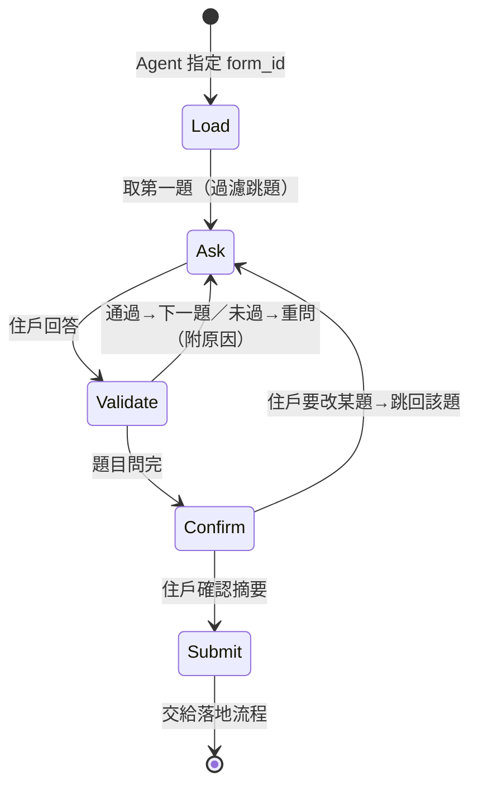

# 03・題組引擎規格

> 決策：全題型＋條件跳題；修繕諮詢、跟團、公設預約三流程共用；跳題設定放官方 `feature` JSONB，不改 DDL（[ADR-0002](../adr/0002-shared-form-engine.md)）。
>
> **實作狀態**：確定性核心已完成於 [`core/forms/`](../../core/forms/)（`models.py` 模型、`engine.py` 引擎、`seed_forms.py` F1/F2/F3），13 個 pytest 全綠（[`tests/test_form_engine.py`](../../tests/test_form_engine.py)）。LLM 口語解析／問句潤飾為上層 Agent，尚未接。

## 職責

讀取表單定義 → 以對話（文字或語音）逐題引導住戶填答 → 驗證 → 摘要確認 → 交給落地流程。

**不負責**：意圖辨識（Agent 核心）、業務寫入（落地流程經統一 API）。

## 題型代碼（全數沿用官方 `pms_form_topic.type`，不自訂）

官方 README 定義的完整題型；「數量」不是題型而是選項層屬性，「日期」用官方 type 9。

| type | 題型 | 答案形態 | 對話引導方式 |
| --- | --- | --- | --- |
| `1` | 簡答 | 文字（`is_number_only` 時限數字） | 開放式提問 |
| `2` | 詳答 | 長文字 | 開放式提問 |
| `3` | 單選 | option id | 唸出選項，接受序號或口語同義（「都可以」→「皆可」） |
| `4` | 複選（含雙層子選項） | option id[]（子選項在 `feature.settings.subOption`） | 先問大項再追問子項 |
| `5` | 地區選單 | county_code＋district_code | 口語地名→代碼（「北屯」→ 台中市北屯區），比對 `pms_topic_county_district_relation` 判斷是否可服務 |
| `6` | 上傳照片 | img_url[]（`minimum/maximum_medias_upload`） | 請住戶傳照片；語音情境允許口頭描述替代（記入 remark） |
| `7` | 備註說明 | 文字 | 補充說明 |
| `8` | 聯絡資料 | 姓名/電話/email/地址 | 已知住戶資料帶入，只確認不重問 |
| `9` | 日期題 | date（`start/end_date_offset_days` 限範圍） | 「哪一天方便？」 |
| `10` | 聯絡資料（不含地址） | 姓名/電話/email | 同 8，不問地址 |

**數量**：不是獨立題型，而是掛在「單選/複選」選項上的屬性——`pms_topic_option.is_quantity` / `min_quantity` / `max_quantity`。引導時在該選項後追問「要幾份？」。
**時段**（上午/下午/晚上）：以「日期題（9）」取日期，再用「單選（3）」取時段，或放進日期題的 `feature` 擴充。

## 跳題規則（`pms_form_topic.feature.skipLogic`）

```json
{
  "skipLogic": {
    "showIf": {
      "topicId": 95,
      "answerIn": [101, 102]
    }
  }
}
```

語意：**僅當** 題目 95 的答案落在選項 101/102 時，本題才出現；否則跳過。無 `skipLogic` 的題目一律出現。條件僅支援單層（夠用且好講），多條件用 `answerIn` 陣列表達。

範例：修繕表單中「冷氣型式（分離式/窗型）」只在「服務項目」選了「冷氣清洗」時出現。

## 引導流程（狀態機）



實作要點：

1. **一次只問一題**，但住戶一句話帶到多題答案時（「明天上午，兩台分離式」）允許一次吃掉多題——引擎按題組定義回填、缺的才追問。
2. 已知資料不重問：聯絡資料（type 10）從 `resident` 帶入，只做確認。
3. 語音模式：問題文字同步產生 TTS；驗證失敗的重問要口語化（「不好意思，我沒聽清楚是上午還是下午？」）。
4. 未完成的填答暫存於對話 session，住戶中途離開可續填。

## 落地流程

| 表單 | 落地目標 | 寫入 |
| --- | --- | --- |
| 修繕／清潔諮詢 | 諮詢單 | `POST /inquiries` → `pms_form_feedback`（`feedback_content` 沿用官方 answerList 格式） |
| 團購跟團 | 跟團訂單 | `POST /campaigns/{id}/join` → `mms_order_record`（07）＋`group_buy_order` |
| 公設預約 | 公設預約單 | `POST /facility-bookings` → `facility_booking` |

## 三份題組定義（seed）

### F1・水電修繕諮詢（官方範例擴寫）

| # | type | 題目 | 選項/限制 | 跳題 |
| --- | --- | --- | --- | --- |
| 1 | 4 | 需要修繕的項目 | 馬桶（子：不通/無法沖水）、燈具（子：不亮/閃爍）、插座、冷氣清洗（`is_quantity=1` 台數 1–5） | — |
| 2 | 3 | 冷氣型式 | 分離式／窗型 | 僅當 Q1 含「冷氣清洗」 |
| 3 | 6 | 現場照片 | 0–3 張（語音可口述替代） | — |
| 4 | 5 | 服務地址（縣市/行政區） | 服務地區限制表 | — |
| 5 | 9 | 方便的日期 | 明日起 14 天內 | — |
| 6 | 3 | 方便時段 | 上午/下午/晚上 | — |
| 7 | 8 | 聯絡資料 | 帶入住戶資料確認 | — |

### F2・團購跟團

| # | type | 題目 | 選項/限制 |
| --- | --- | --- | --- |
| 1 | 3 | 品項 | 活動品項（`is_quantity=1`，min 1、max 依活動設定→「要幾份？」） |
| 2 | 3 | 取貨方式 | 社區管理室／7-ELEVEN 門市（roadmap 選項，demo 選管理室） |
| 3 | 10 | 聯絡資料 | 帶入確認 |

### F3・公設預約（demo 現場載入的「新服務」）

| # | type | 題目 | 選項/限制 |
| --- | --- | --- | --- |
| 1 | 3 | 公設 | 交誼廳／健身房／KTV 室 |
| 2 | 9 | 使用日期 | 7 天內 |
| 3 | 3 | 使用時段 | 各時段容量檢查 |
| 4 | 1 | 使用人數 | `is_number_only=1`，1–capacity |
