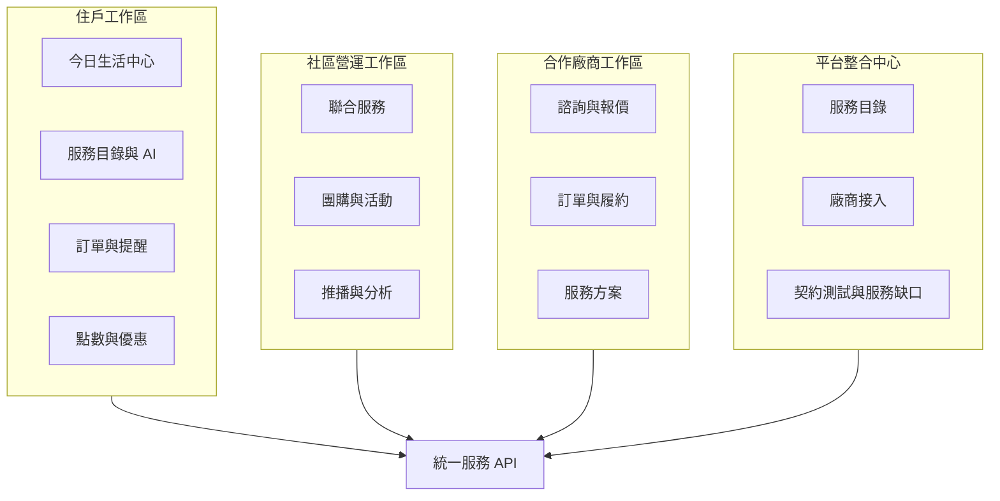

# 05・Web 工作區模組規格

> 單一 RWD Web 應用依角色與任務切成住戶、社區營運、合作廠商、平台整合四個工作區（[ADR-0006](../adr/0006-single-web-platform-four-workspaces.md)）。競賽環境可用假登入切換角色；所有工作區共用統一服務 API，AI 功能沿用當前角色權限，寫入操作必須預覽並確認。

## 跨工作區前端基線

- **單一 Vue 3 應用**：四個工作區共用導覽、表單、狀態、通知、AI 建議、確認流程與設計 token，不各做一套 UI。
- **桌機與手機同等可完成**：桌機以側欄＋主內容支援營運密度；手機與 LINE 內開啟時改為單欄、底部主要導覽或抽屜，功能不得因縮版消失。
- **內容驅動重排**：一般內容在 320 CSS px 寬度可單向捲動完成；表格、地圖等確實需要二維呈現者提供卡片摘要、欄位挑選或獨立橫向捲動區。
- **LINE WebView 相容**：Bot、Flex Message 或 Rich Menu 以 URI action 導向 Web 深層連結；版面使用動態 viewport 單位，底部固定操作列納入 `safe-area-inset-bottom`，不得被 LINE 或系統導覽列遮住。LINE SDK 能力由 adapter/composable 隔離，外部瀏覽器仍可正常使用；只有需要 LINE Login、聊天室互動或關閉 LIFF 視窗等能力時才載入 LIFF。
- **WCAG 2.2 AA**：語意化標題與 landmark、完整鍵盤操作、可見焦點、表單標籤與錯誤摘要、狀態訊息、非僅靠顏色傳意、支援 200% 文字縮放與 `prefers-reduced-motion`。
- **點擊目標**：規範最低不小於 24×24 CSS px；本專案主要操作以 44×44 CSS px 為設計目標，提升觸控、樂齡與 LINE 內使用體驗。
- **對比驗收**：一般文字至少 4.5:1、大字至少 3:1；元件邊界、狀態與焦點另檢查非文字對比。所有五種風格探索均受相同門檻約束。

### 共同響應式驗收畫面

風格探索先以「今日生活中心」作為共同樣本：同時放入 AI 今日建議、推薦理由與「不感興趣」、點數優惠、提醒、服務入口及訂單狀態，分別以 1440×900 桌機與 390×844 手機／LINE 情境比較。選定方向後再擴展到社區 Hero、廠商工作區與平台整合中心。

## 模組總覽

## 住戶工作區

### 今日生活中心 ★ 第二主要展示線

| 區塊 | 內容 | 互動 |
| --- | --- | --- |
| AI 今日建議 | 由行為軌跡、時間、天氣與即將到期優惠產生，必須顯示推薦理由 | 採用、不感興趣、復原 |
| 消費摘要 | 本月消費、OPENPOINT、優惠券、常用通路 | 展開明細與月份切換 |
| 點數計算機 | 比較點數、優惠券與支付組合的實付/累點結果 | 選購買情境後重新試算 |
| 今日提醒 | 補貨、包裹、優惠到期與個人任務 | 完成、延後、編輯 |
| 服務入口 | 官方 8 項服務＋商城購物，共 9 項可操作服務 | 搜尋、AI 描述需求、進入服務 |
| 訂單進度 | 清潔、寄件、訂位、外送、購物與社區聯合服務統一呈現 | 查看時間軸、客服與再次使用 |

### 服務探索與 AI 助理

- 服務依清潔、寄件、訂位、外送、修繕、購物等領域分組，支援自然語言搜尋。
- 每張服務卡都必須能進入填答並建立諮詢單或訂單，不放無後續行為的空卡片。
- DUSKIN、黑貓、foodomo、EZTABLE、7-ELEVEN 顯示各自適用的品牌欄位與流程，其餘服務使用共用流程。
- 健康、旅遊、考試週等是推薦或任務模板，不建立孤立頁面。

## 社區營運工作區

### 聯合服務管理 ★ Hero

| 功能 | 說明 |
| --- | --- |
| 建立活動 | AI 依目標產生服務說明、住戶表單、時段與通知草稿 |
| 需求看板 | 彙整參與戶數、設備台數、偏好時段、特殊需求與填答完成率 |
| 廠商媒合 | 比較合作廠商方案、涵蓋範圍、時段、報價與評分 |
| 確認派單 | 預覽彙整內容後，由管理者確認送給合作廠商 |
| 履約分析 | 追蹤接單、排程、完成率、異常及住戶評價 |

Hero 固定使用 DUSKIN 社區冷氣聯合清洗；管理費不在競賽範圍。

### 團購、推播與其他社區模組

- 團購：開團、進度、結單、採購單、到貨與收款提醒。
- 推播：AI 文案草稿、分眾、預覽確認、發送與紀錄。
- 公設與活動：保留為 P1/P2 延伸，不占 Hero 主流程。
- 報表：服務使用量、金額、完成率、聯合服務參與率與服務缺口。

## 合作廠商工作區

| 模組 | 功能 |
| --- | --- |
| 諮詢單 | 收件匣、填答摘要、照片、AI 回覆草稿 |
| 報價 | 分項費用、可服務時段、有效期限、預覽後送出 |
| 訂單履約 | 接單、排程、進行中、完工、取消/異常與事件通知 |
| 服務方案 | 價格、服務範圍、時段、表單與上架狀態 |
| 接入資訊 | 查看標準、轉接或工作台接入狀態；API 憑證只顯示遮罩資訊 |

Hero 畫面包含 DUSKIN 收到社區彙整需求、確認時段與更新履約狀態。

## 平台整合中心

| 模組 | 功能 |
| --- | --- |
| 服務目錄 | 管理 9 項可操作服務及五條深度品牌服務 |
| 合作廠商 | 公司、服務方案、涵蓋地區、評分與啟用狀態 |
| 接入器 | 標準/轉接/工作台模式、版本、健康度、最近同步與回呼紀錄 |
| 契約測試 | 對服務查詢、報價、下單、狀態回呼執行測試並顯示統一結果 |
| 服務缺口 | 彙整無對應服務的需求，讓 AI 草擬新表單與流程，經人確認後發布 |

此工作區負責證明「廠商接上一次，住戶、社區、AI、LINE 與 MCP 都能共用」的核心賣點。

## 權限矩陣

| 模組 | 住戶 | 社區管理者 | 合作廠商 | 平台方 |
| --- | --- | --- | --- | --- |
| 今日生活中心、個人訂單/優惠 | 自己 | 僅聚合/授權資料 | — | 稽核所需最小資料 |
| 社區聯合服務、團購、推播 | 參與 | 管理所屬社區 | 接收已派案件 | 全域設定/稽核 |
| 諮詢、報價、履約 | 自己的案件 | 所屬活動唯讀 | 自家案件可編輯 | 全域稽核 |
| 服務目錄與接入器 | 查詢 | 查詢 | 自家方案/接入狀態 | 全域管理 |

## Demo 深度

- ★ 完整入鏡：今日生活中心、DUSKIN 聯合服務、合作廠商履約、平台接入器。
- 完整但快速帶過：9 項服務目錄與品牌服務入口。
- 延伸展示：團購、家庭共享、超商庫存、任務模板與 LINE 通知。
