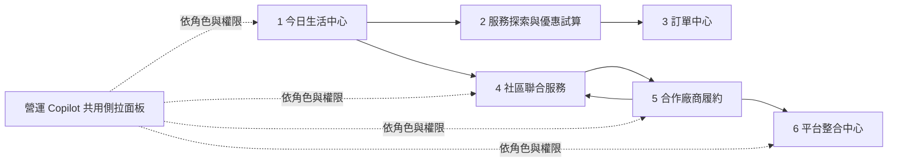

# 07・競賽 Demo 垂直切片與頁面規格

> 狀態：競賽版實作基線（2026-07-24）  
> 依據：[00 產品與情境](00-product-and-scenarios.md)、[04 MCP 與統一 API](04-mcp-and-api.md)、[05 Web 工作區模組](05-erp-modules.md)、[06 SRS](06-system-requirements.md)、[ADR-0010](../adr/0010-hero-personal-hub-and-service-breadth.md)  
> 視覺基線：`web/design-directions/` 的 **08 資訊架構與生活感＋07 青綠／琥珀配色**，採頂部導覽、無彩色陰影。

## 1. 文件目的

這份文件把已定案的產品範圍收斂成一個可直接切前後端工作的競賽版垂直切片。評審在五分鐘內應清楚看見三件事：

1. 沒有社區身分的個人，也能以「今日生活中心」完成推薦、優惠試算與服務履約。
2. 社區需求能透過 AI 結構化，交由合作廠商報價、履約並回傳狀態。
3. 廠商只要接上一次「統一服務契約」，同一能力即可被 Web、AI、LINE 與後續 MCP 通路共同使用。

競賽版不是把需求清單中的每項能力各做一個獨立頁面，而是先完成可操作的共用閉環。家庭、團購、零售、提醒與情境推薦等功能，後續沿用相同的範圍、題組、訂單、事件與推薦機制擴充，不另建孤立系統。

## 2. 競賽版的兩條主線

### 2.1 主線 A：個人今日生活中心

**角色**：不需要加入社區的一般使用者  
**評審感受**：平台真的理解生活脈絡、會說明推薦原因，而且能把建議推進到可執行的服務或訂單。

1. 使用者進入今日生活中心，看見即將到期優惠、咖啡習慣推薦、補貨建議、包裹與跨服務進度。
2. 展開「為什麼推薦」，看到可驗證的推薦依據；選擇「不感興趣」後，卡片淡出並可立即復原。
3. 點入 CITY CAFE／7-ELEVEN 服務，系統以優惠券、OPENPOINT 與 icash Pay 簡化規則進行真實可重算的折扣試算。
4. 使用者預覽並確認後建立訂單，再到訂單中心查看處理狀態；同頁也能看到黑貓包裹等其他服務進度。

### 2.2 主線 B：社區需求到廠商履約與平台接入

**角色**：社區管理者 → 合作廠商 → 平台營運者  
**Hero**：DUSKIN 社區冷氣聯合清洗  
**評審感受**：AI 不只聊天，而是能在權限與確認機制下，驅動跨角色、跨廠商的營運流程。

1. 社區管理者查看住戶需求彙總，請營運 Copilot 整理冷氣清洗需求並草擬聯合服務活動。
2. 管理者預覽題組、服務範圍、截止時間與通知文案，確認後發起活動。
3. 已接入平台的合作廠商在廠商工作區收到統一格式的諮詢需求，建立報價並更新履約狀態。
4. 社區管理者即時看到報價與狀態回流，不必逐家以不同格式追問。
5. 平台整合中心顯示 DUSKIN 採用的接入模式、欄位映射、健康狀態與測試紀錄，並同時證明其他服務可重用相同契約。

### 2.3 備用展示：社區團購

團購不是五分鐘主線，但保留為 30–40 秒的備用展示。它重用題組引擎、`owner_scope=group`、訂單狀態與廠商工作區，證明平台不是只為冷氣清洗打造。若主舞台時間不足，不進入此流程。

## 3. 五分鐘展示節奏

| 時間 | 畫面／動作 | 要證明的能力 |
| --- | --- | --- |
| 0:00–0:40 | 今日生活中心：個人摘要、推薦依據、不感興趣／復原 | 個人服務基線、可解釋推薦、偏好調教 |
| 0:40–1:25 | 服務與優惠：開啟 CITY CAFE／7-ELEVEN，完成折扣試算 | 9 項服務可操作、點數與優惠可真算 |
| 1:25–1:50 | 訂單中心：確認建立與跨服務進度 | 從建議到履約，不是展示卡片 |
| 1:50–3:10 | 社區聯合服務：需求彙總、AI 草擬、預覽確認 | 社區 Hero、題組引擎、AI 權限邊界 |
| 3:10–3:55 | 廠商工作區：接單、報價、更新狀態 | 無論有無既有 API 都能接入 |
| 3:55–4:20 | 回到社區頁查看狀態回流 | 跨角色單一資料流與事件同步 |
| 4:20–4:50 | 平台整合中心：三種模式、測試與欄位映射 | 「廠商接一次，所有通路共用」的核心賣點 |
| 4:50–5:00 | 顯示 LINE 深層連結入口 | Web-first，但 LINE 可直接延伸；LIFF 非必要 |

## 4. 六個主畫面的資訊架構

共用頂部列包含品牌、工作區／角色切換、全站搜尋、通知與個人選單。桌機採頂部導覽；手機版收斂為精簡頂列與底部主要導覽。營運 Copilot、確認預覽與通知中心都是跨頁元件，不計入六個主畫面。

## 5. 逐頁功能規格

### 5.1 今日生活中心

**路由**：`/app/today`  
**主要角色**：個人／住戶  
**一句話任務**：在 10 秒內知道「今天最值得處理什麼」。

| 區塊 | 可見內容 | 主要互動 |
| --- | --- | --- |
| 今日摘要 | 本月消費、OPENPOINT、即將到期優惠、待處理訂單 | 點入明細或服務 |
| 推薦佇列 | 咖啡、補貨、天氣情境與服務推薦 | 展開推薦依據、不感興趣、復原、立即處理 |
| 生活提醒 | 包裹、優惠到期、補貨週期、已排程事項 | 完成、延後、進入訂單 |
| 跨服務進度 | 7-ELEVEN、黑貓、foodomo 等近期訂單 | 前往訂單中心 |
| 快速服務入口 | 9 項可操作服務 | 進入服務探索頁，禁止死卡 |

**核心呼叫**：`get_behavior_summary`、`get_recommendations`、`record_recommendation_feedback`、`get_consumption_dashboard`、`list_reminders`、`list_my_orders`。  
**成功條件**：評審看得懂推薦原因；按下「不感興趣」後畫面與偏好狀態同步變更，且可復原。  
**穩定展示**：使用固定日期與種子行為，避免當天天氣或外部 API 改變畫面主敘事。

### 5.2 服務探索與優惠試算

**路由**：`/app/services/:serviceSlug?`  
**主要角色**：個人／住戶  
**一句話任務**：找到服務、完成必要填答，並知道最划算的付款組合。

| 區塊 | 可見內容 | 主要互動 |
| --- | --- | --- |
| 服務目錄 | 官方 8 項＋商城購物，共 9 項服務 | 搜尋、篩選、開啟服務詳情 |
| 服務詳情 | 品牌流程、所需欄位、可用時段與履約說明 | 以題組完成需求填答 |
| 優惠試算 | 優惠券、OPENPOINT、icash Pay 簡化規則 | 切換組合並即時計算差額 |
| 替代方案 | 替代商品、合作廠商或其他時段 | 比較後選擇 |
| 確認摘要 | 品項、時段、折抵、應付金額與資料用途 | 預覽後確認建立諮詢單／訂單 |

**Demo 預設**：由今日生活中心深層連結至 CITY CAFE／7-ELEVEN 補給情境；其餘 8 項可在目錄中完成至少一個後續動作。  
**核心呼叫**：`list_services`、`search_services`、`get_service_form`、`calc_discount`、`submit_inquiry`、`create_order`。  
**成功條件**：金額由規則引擎計算，不由 LLM 自由生成；確認後取得可追蹤編號。

### 5.3 訂單中心

**路由**：`/app/orders`、`/app/orders/:orderId`  
**主要角色**：個人／住戶  
**一句話任務**：跨服務查看「現在到哪裡、下一步要做什麼」。

| 區塊 | 可見內容 | 主要互動 |
| --- | --- | --- |
| 狀態總覽 | 待確認、處理中、待取件／履約、已完成 | 依狀態篩選 |
| 訂單列表 | 品牌、服務、編號、下一節點與更新時間 | 開啟時間軸 |
| 履約時間軸 | 建立、付款、接單、配送／到場、完成 | 查看事件細節 |
| 異常入口 | 延誤、付款或履約問題 | 建立客服工單 |

**核心呼叫**：`list_my_orders`、`get_order_status`、`create_support_ticket`。  
**成功條件**：剛建立的訂單立即出現；黑貓等其他服務使用相同狀態元件呈現。

### 5.4 社區聯合服務

**路由**：`/ops/joint-services/:campaignId`  
**主要角色**：社區管理者  
**一句話任務**：把分散住戶需求整理成可交付合作廠商的聯合服務活動。

| 區塊 | 可見內容 | 主要互動 |
| --- | --- | --- |
| 活動摘要 | 活動狀態、參與戶數、截止時間、預估量 | 切換活動與狀態 |
| 匿名需求彙總 | 冷氣台數、機型、樓層、可服務時段 | 查看群體統計，不顯示個人敏感資料 |
| Copilot 草稿 | 活動內容、住戶題組、通知文案、風險提示 | 編輯、預覽、確認發送 |
| 媒合與報價 | 合作廠商方案、價格、評分、可用時段 | 比較、確認指派 |
| 事件進度 | 已發起、收件、報價、指派、履約 | 查看狀態回流 |

**核心呼叫**：`create_joint_service`、`join_joint_service`、`get_joint_service_summary`、`match_vendors`、`assign_joint_service_vendor`。  
**成功條件**：AI 只能產生可編輯草稿；發送與指派一定經過預覽和明確確認。  
**隱私條件**：社區管理者只看完成營運所需的彙總與經授權資料，不可查看個人行為特徵檔。

### 5.5 合作廠商履約

**路由**：`/vendor/inquiries/:inquiryId`  
**主要角色**：合作廠商  
**一句話任務**：即使廠商沒有自己的 API，也能用統一格式接單、報價與回報進度。

| 區塊 | 可見內容 | 主要互動 |
| --- | --- | --- |
| 待辦佇列 | 新諮詢、待報價、待確認、履約中 | 篩選、指派內部人員 |
| 統一需求摘要 | 戶數、設備量、服務範圍、時段與附件 | 展開原始題組答案 |
| 報價編輯 | 方案、單價、總價、有效期限與備註 | 預覽、確認送出 |
| 履約狀態 | 已接單、已排程、到場、完成、異常 | 更新狀態並留下事件 |

**核心呼叫**：`list_pending_inquiries`、`create_quote`、`update_order_status`。  
**成功條件**：送出報價或更新狀態後，社區頁不經人工重打即可看到回流結果。  
**接入訊息**：工作台是三種廠商接入模式之一，不把「沒有 API」視為無法合作。

### 5.6 平台整合中心

**路由**：`/platform/connectors`、`/platform/connectors/:connectorId`  
**主要角色**：平台營運者  
**一句話任務**：證明廠商只需接一次統一服務契約，即可被所有通路共同使用。

| 區塊 | 可見內容 | 主要互動 |
| --- | --- | --- |
| 接入器總覽 | 品牌、服務、接入模式、版本、健康狀態 | 篩選與開啟詳情 |
| 三種接入模式 | 標準接入、轉接接入、工作台接入 | 查看各模式說明與範例 |
| 欄位映射 | 上游欄位 → 統一服務契約欄位 | 檢查轉換結果 |
| 測試主控台 | 請求、驗證、回應、延遲與最後測試時間 | 執行測試、查看結果 |
| 通路覆蓋 | Web、AI、LINE、MCP 的可用狀態 | 查看同一服務的共用情形 |
| 服務方案管理 | 官方服務項目與合作廠商方案映射 | 新增／更新方案 |

**核心呼叫**：`list_vendor_connectors`、`test_vendor_connector`、`upsert_vendor_offering`。  
**成功條件**：至少展示一個標準接入、一個 Adapter 與一個工作台接入；DUSKIN 的欄位測試可成功執行。  
**用詞要求**：介面必須區分「官方服務來源」與「合作廠商」，不可混稱官方廠商。

## 6. 全域元件與互動規則

### 6.1 營運 Copilot

- 以右側側拉面板呈現，保留當前頁脈絡，不強迫使用者離開工作流程。
- 依工作區與角色提供不同建議；只讀到角色原本有權限查看的資料。
- 所有寫入、推播、報價、指派與下單都先產生「變更預覽」，使用者確認後才呼叫 API。
- AI 回答中提及的訂單、優惠、廠商與數字都可點回對應來源。
- 不把聊天回覆當作交易成功；成功與否以後端回傳及事件紀錄為準。

### 6.2 推薦卡片

- 顯示可讀的推薦依據，例如「近三個月都在月初購買」或「優惠兩天後到期」。
- 提供「不感興趣」而非永久封鎖；降低服務、商品、品牌或主題及相似內容的後續分數。
- 操作後顯示可復原提示，避免誤觸造成不可逆的偏好改變。
- 過敏與飲食禁忌是硬性排除，不與「不感興趣」混用。

### 6.3 RWD 與無障礙

- Vue 元件自第一版即通過桌機 1440 px 與手機 390 px 的核心流程，不以桌機頁面事後縮小。
- 目標符合 WCAG 2.2 AA：鍵盤可操作、焦點可見、表單標籤完整、錯誤不只靠顏色、文字與互動狀態對比合格。
- 主要觸控目標至少 44 × 44 px，手機版支援 safe area 與 LINE WebView。
- 資料表在手機改為重點卡片或可展開列，不使用橫向縮小到不可讀的完整桌面表格。
- 陰影僅使用中性灰；青綠與琥珀作為狀態與行動色，不用於大面積彩色陰影。

## 7. AI、規則、資料與 Mock 的責任邊界

| 能力 | AI 負責 | 後端／規則負責 | 競賽資料來源 |
| --- | --- | --- | --- |
| 意圖與需求 | 理解自然語言、產生結構化草稿 | Schema 驗證、權限、必填與落地流程 | 固定提示＋題組定義 |
| 推薦 | 理解語境、協助排序、自然語言解釋 | 特徵計算、候選集、分數、硬性排除、回饋衰減 | 種子行為＋種子優惠＋固定情境 |
| 折扣 | 解釋方案差異 | 點數、優惠券與支付規則的確定性計算 | 自建中度真帳本；不宣稱 OPENPOINT 即時正式 API |
| 訂單與履約 | 摘要狀態、提出下一步 | 狀態機、編號、事件、寫入與稽核 | 官方訂單資料＋自建種子事件 |
| 社區需求 | 彙整、草擬題組／文案、提示風險 | 匿名彙總、範圍隔離、建立活動、媒合與指派 | 官方題組資料＋自建社區種子 |
| 廠商媒合 | 說明比較理由 | 價格、時段、服務區與評分的可重算排序 | 自建合作廠商與方案 |
| 廠商串接 | 協助解釋錯誤與產生映射建議 | Adapter、契約驗證、健康檢查、重試與事件 | 三種模擬接入器 |
| 天氣／外部情境 | 將情境轉成自然建議 | 快取、時間與地區判斷 | 固定種子為預設；外部 API 僅作可選增強 |

### 7.1 Mock 原則

1. 前端只呼叫平台的 `/api/v1` 或 MCP 工具，不直接耦合廠商假端點。
2. 模擬的是「廠商上游系統」與尚未取得的品牌能力，不模擬平台自己的核心狀態機。
3. Mock 回應必須符合統一服務契約，包含成功、驗證失敗、逾時與重試情境。
4. 介面不需特別標示「Demo」，但簡報與技術文件不得把種子資料或模擬接入器描述成正式即時合作 API。
5. `raw_data/` 與 `official_docs/` 用於官方欄位、服務與情境依據；實際履約合作廠商仍使用自建 `vendor` 資料。

## 8. 固定展示資料

為避免五分鐘展示受到時間、網路與外部服務波動影響，提供可重設的 `demo_seed_v1`：

| 類別 | 建議固定值 |
| --- | --- |
| 個人 persona | **小圓**；目前設計稿若仍使用「怡君」，進 Vue 前統一改名 |
| 個人推薦 | 月初補貨、CITY CAFE 習慣、兩天後到期優惠、黑貓包裹待取 |
| 社區 | 晴川社區，社區管理者帳號預載權限 |
| Hero 活動 | DUSKIN 冷氣聯合清洗，預載 18 戶需求，另保留 2 戶可現場加入 |
| 合作廠商 | 每服務 2–3 家；Hero 預載至少 2 份可比較方案 |
| 接入模式 | DUSKIN／深度品牌至少一個 Adapter；另各有標準與工作台接入案例 |
| 服務目錄 | 官方 8 項＋商城購物共 9 項，每項都有下一步動作 |
| 時間 | 可注入固定 `demo_now`，確保到期日、提醒與排序一致 |

Demo 帳號可透過頂部角色切換器在個人／社區管理者／合作廠商／平台營運者間切換；正式環境仍依 OIDC／角色授權，不提供任意切換。

## 9. P0 驗收範圍

### 9.1 功能驗收

- [ ] 六個主畫面皆可由頂部導覽或流程深層連結進入，無死連結。
- [ ] 今日生活中心能顯示推薦依據，完成不感興趣與復原。
- [ ] 折扣試算由確定性規則計算，確認後能建立可追蹤訂單。
- [ ] 9 項服務每項至少能完成填答、建立諮詢／訂單或查看狀態之一。
- [ ] DUSKIN 聯合服務能完成建立、住戶需求彙總、廠商報價、指派與狀態回流。
- [ ] 廠商工作區送出的報價與狀態會反映到社區頁。
- [ ] 平台整合中心能顯示並測試標準、轉接、工作台三種接入模式。
- [ ] 所有 AI 寫入操作都有預覽、明確確認與成功／失敗回饋。
- [ ] `demo_seed_v1` 可一鍵重設，核心展示在離線或外部 API 故障時仍可完成。

### 9.2 UI／UX 驗收

- [ ] 1440 × 900 與 390 × 844 皆能走完兩條主線。
- [ ] 鍵盤能完成核心流程，焦點順序與焦點樣式清楚。
- [ ] 自動化掃描與人工檢查均無 WCAG 2.2 AA 的重大阻擋問題。
- [ ] 主要操作觸控目標至少 44 × 44 px；LINE WebView safe area 不遮擋操作。
- [ ] 載入、空資料、驗證失敗、權限不足、逾時與重試皆有設計狀態。
- [ ] 青綠／琥珀配色符合對比要求，陰影保持中性，不以顏色單獨傳達狀態。

## 10. 第一輪不阻塞 P0 的功能

以下需求保留在產品範圍內，但不阻塞第一輪垂直切片：家庭共享／長輩代辦、正式團購完整收款、商品庫存與候補、旅遊與考試週模板、語音進出、ibon 文件處理、小賣家寄件、正式 LINE Login／LIFF、真實支付與正式廠商 API。

處理原則如下：

- 能重用 P0 核心實體者，先保留入口與資料契約，不做獨立假頁面。
- 服務卡片若出現在競賽版，就必須有實際下一步；尚未可操作的能力不混入 9 項 P0 目錄。
- LINE 先以 Bot／Rich Menu／Flex Message 導向 Web 深層連結；只有需要 LINE Login、取得好友／聊天室資訊或視窗控制時才加入 LIFF。

## 11. 建置順序

| 順序 | 工作包 | 完成定義 |
| --- | --- | --- |
| 0 | Demo fixture 與契約 | `demo_seed_v1`、角色、狀態機、統一 DTO 與 reset 機制可用 |
| 1 | Vue 應用骨架 | 設計 token、頂部導覽、四工作區、RWD、無障礙基礎元件完成 |
| 2 | 平台共用閉環 | 題組、確認預覽、諮詢／訂單、事件、通知與 Copilot 外殼可串接 |
| 3 | 社區 Hero＋廠商 | DUSKIN 從活動到報價及狀態回流端到端完成 |
| 4 | 個人主線 | 今日生活中心、推薦回饋、折扣試算與訂單中心完成 |
| 5 | 接入證明與廣度 | 平台整合中心與 9 項可操作服務完成 |
| 6 | 展示硬化 | 390／1440、WCAG、錯誤狀態、離線備援、五分鐘彩排完成 |

此順序以底層依賴為準；實際展示仍依第 3 節先從個人主線開始，再進入社區 Hero。
