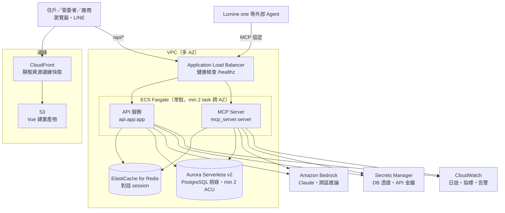

# 09・AWS 架構

> 建立日期：2026-07-27　最近驗證：2026-07-31　狀態：**目標架構已定；Learner Lab 部署路徑已實測，尚未建立資源；官方競賽環境規範已公告並收錄（第 3 節）**
>
> 這份文件回答簡報必答的一題：**「為什麼你的 AWS 架構是這樣設計的？」**
>
> 決策基準見 [ADR-0018](../adr/0018-aws-sized-for-speed.md)：AWS 額度由主辦提供，
> 因此選型的目標函數是**評審操作時的體感延遲**，不是省成本。移植紀律仍依
> [ADR-0004](../adr/0004-local-first-aws-portable.md)：所有外部相依都藏在介面之後。

## 1. 一句話回答

**架構的每一個選擇，都對應到一段被消除的等待。**

| 使用者感受到的等待 | 造成它的選擇（不採用） | 我們的選擇 |
| --- | --- | --- |
| 打開網站的第一秒 | S3 靜態網站直出 | CloudFront 邊緣快取 |
| 送出第一個請求 | Lambda 冷啟動 | **ECS Fargate 常駐**（min 2 task） |
| 第一次查資料 | Aurora Serverless v2 從 0.5 ACU 暖機 | **最小 2 ACU** |
| AI 回應 | 跨太平洋呼叫地端模型 | **Bedrock（同區）** |
| 換一台機器就要重填表單 | 行程內記憶體存 session | **ElastiCache** |

上表是正式環境的目標架構，不代表目前 Learner Lab 已開放所有服務；實測差異如下。

## 2. Learner Lab 實測狀態

2026-07-29 使用課程提供的臨時憑證進行唯讀 API、IAM policy simulation 與 EC2
官方 `--dry-run`。沒有建立、修改或刪除任何 AWS 資源。

| 能力 | 結果 | 證據／影響 |
| --- | --- | --- |
| 臨時憑證 | 可用 | STS `GetCallerIdentity` 成功；角色為 `voclabs` |
| 區域與既有網路 | `us-east-1` 可用 | 既有 default VPC、6 個 subnet |
| EC2 | **可建立** | `t3.small` + `LabInstanceProfile` 的 `RunInstances --dry-run` 回傳 `DryRunOperation` |
| ECS / ECR | 動作政策允許 | `CreateCluster`、`RegisterTaskDefinition`、`CreateService`、ECR push 模擬為 allowed |
| ECS task role | 可用 | 將既有 `LabRole` 傳給 `ecs-tasks.amazonaws.com` 的 `iam:PassRole` 為 allowed |
| ALB / EFS | 動作政策允許 | 建立 load balancer、target group、listener、file system、mount target 皆為 allowed |
| S3 / CloudFormation | 可用 | 建立與寫入動作模擬為 allowed |
| RDS | **僅小型 provisioned DB** | PostgreSQL `db.t4g.micro` 為 allowed；Aurora `db.serverless` 為 explicit deny |
| ElastiCache | 可用 | `CreateCacheCluster` 與 `cache.t4g.micro` 模擬為 allowed |
| Secrets Manager / SSM | 可用 | 建立及讀取 secret／parameter 模擬為 allowed |
| CloudWatch Logs | 可用 | 建立 log group、寫入 log event 模擬為 allowed |
| Bedrock | **不可用** | `ListFoundationModels`、inference profile 與 `InvokeModel` 均未授權 |
| CloudFront | **不可用** | list 與 create distribution 均未授權 |
| Service Quotas | 不可讀 | 無法由 API 確認 Fargate quota |
| 本月 AWS 帳面用量 | 約 USD 0.80 | Cost Explorer 可讀；Learner Lab 剩餘 credits 不在 AWS Budget API 中 |

帳號目前沒有 `AWSServiceRoleForECS` 與
`AWSServiceRoleForElasticLoadBalancing`，建立 service-linked role 的權限也未獲確認。
因此 ECS/ALB 雖然個別動作政策允許，第一次建立 service 時仍可能卡在 IAM；不能把它當成
已驗證可部署路徑。

### 2.1 Learner Lab 第一版部署決策

先用已通過真實 dry-run 的 EC2 路徑完成 Live Demo：

| 項目 | 第一版規格 |
| --- | --- |
| 運算 | 1 台 EC2 `t3.small`（2 vCPU、2 GiB），Amazon Linux 2023 |
| 儲存 | 20 GiB gp3；SQLite 與展示資料每日備份 |
| IAM | 使用既有 `LabInstanceProfile`／`LabRole`，不建立新角色 |
| 程序 | Docker Compose：Nginx／Vue、FastAPI、Fake Vendor Server |
| 對外入口 | EC2 Elastic IP + Nginx TLS；暫不依賴 CloudFront／ALB |
| AI | 延續目前 OpenAI-compatible endpoint；Bedrock 權限解鎖後再換 adapter |
| 憑證 | SSM Parameter Store 或 Secrets Manager；不把 `.env`／AWS credentials 放進 image |
| 監控 | CloudWatch Agent／Logs，保留 7 天 |

這不是正式環境的最終形態，而是受限 Learner Lab 中風險最低、最容易穩定展示的 tracer
deployment。ECS、RDS、Redis adapter 完成且 service-linked role 問題排除後，再切換第 4 節架構。

## 3. 官方競賽環境規範與限制（2026-07-22 公告）

來源：[official_docs/黑客松競賽環境規範與限制_20260722.pdf](../../official_docs/黑客松競賽環境規範與限制_20260722.pdf)
與 [official_docs/Supported AWS Services List 20260722.xlsx](../../official_docs/Supported%20AWS%20Services%20List%2020260722.xlsx)。
這是**正式競賽環境**的規則，與第 2 節的 Learner Lab（練習環境）是兩個不同的帳號體系；
兩者衝突時以官方公告為準。官方也聲明各項限制可能依實際情況調整，最終以競賽期間公告為準。

### 3.1 一般規範

- **區域**：以 `us-east-1` 與 `us-west-2` 為指定主要區域。
- **禁止公開存取**：S3 bucket 不得公開（用 Block Public Access／bucket policy 擋）；
  EC2 的 Security Group 不得對外完全開放；RDS 與 EMR 不得啟用公開存取。
- **禁止上傳的資料**（13 類）：個資、受管制資料、財務資訊、種族／政治／宗教／工會／
  性取向資訊、基因與生物識別資料、健康資料、付款處理資料、惡意程式。
- **資源節約**：執行個體數量僅限必要工作所需。
- **機密憑證**（AWS keys、API tokens、DB 密碼）不得進入公開 repo；以 `.gitignore` 與
  環境變數管理。
- **Kiro 使用者**：公開 repo 的根目錄必須包含 `/.kiro` 資料夾（展示 specs／hooks／
  steering 使用情況），不得加入 `.gitignore`。

### 3.2 Amazon Bedrock

- **請求限制 1 RPS／TPS 以下**——整個帳號層級的硬限制。
- 只申請當前專案直接相關的模型存取權，定期檢視並撤銷不再使用的模型。

### 3.3 運算資源限制

EC2 vCPU 配額（全區域）：

| 執行個體家族 | 配額 |
| --- | --- |
| Standard（A、C、D、H、I、M、R、T、Z） | 256 vCPU |
| HPC | 192 vCPU |
| DL | 96 vCPU |
| F | 64 vCPU |
| Inf／Trn | 各 8 vCPU |
| **G／VT、P、X、High Memory** | **0 vCPU（不可用）** |

GPU 執行個體（G／P）全面歸零；SageMaker AI 另有逐機型配額表（xlsx 第二張工作表，
約 1900 條）。官方並明言**不建議在比賽中進行大規模模型訓練**。

### 3.4 服務支援面

Services List 列出 315 個 IAM namespace 及允許的 actions，涵蓋第 4 節目標架構的全部服務：
CloudFront、S3、ECS／ECR、ALB、RDS、ElastiCache、Secrets Manager、SSM、CloudWatch、
Lambda、API Gateway、Cognito、Step Functions、SQS／SNS／EventBridge，以及 Bedrock
（含 `bedrock-agentcore`）。這確認了第 2 節 Learner Lab 中 Bedrock 與 CloudFront 不可用
是 **Lab 的限制，不是正式環境的限制**。Aurora `db.serverless` 在 Learner Lab 被明確拒絕，
正式環境是否可用仍待現場確認。

### 3.5 對本架構的影響

| 規範 | 影響 |
| --- | --- |
| Bedrock ≤ 1 RPS | Bedrock 版 `LlmClient` 必須內建**序列化佇列＋退避重試**，不能平行發出 LLM 呼叫。「一則使用者訊息＝一次 interpret 呼叫」的現有設計要守住；多位評審同時操作時需要有排隊中的 UI 回饋，而不是逾時。 |
| GPU 配額 0 | 雲端**不可能自架 Gemma**，Bedrock 是唯一的雲端 LLM 路徑——第 5.4 節的決策從「較好」變成「唯一」。 |
| S3 禁公開 | 靜態站不能退回 S3 website hosting，必須 CloudFront + OAC 讀私有 bucket；與既有選擇一致。 |
| EC2 SG 禁全開 | 第一版 EC2 部署（2.1）的 Security Group 僅開 80／443（SSH 走 SSM Session Manager，不開 22）。 |
| 資料 13 類禁令 | 官方樣本資料是主辦提供的雜湊化資料，不在禁令內；除此之外不得把任何真實個資帶進環境（demo persona 一律虛構）。 |
| 區域指定 | 與既定的 `us-east-1` 一致，無需變更。 |

## 4. 目標部署架構

## 5. 逐項理由（評審會問的就是這一節）

### 5.1 為什麼 ECS Fargate 而不是 Lambda？

命題的評分表寫著「使用體驗良好流暢」，且評委「以使用者的角度去體驗」。
Lambda 的冷啟動會落在**評審按下第一個按鈕的那一刻**——那正是第一印象。

- **常駐 task，最少 2 個跨 AZ**：沒有冷啟動，同時滿足可用性。
- 仍然容器化（見專案根目錄 `Dockerfile`），所以「改用 Lambda 容器映像」隨時做得到。
  這個可逆性是 ADR-0004 介面隔離換來的，不是碰巧。
- 若要壓成本，正確作法是 Lambda ＋ provisioned concurrency；但額度是主辦提供的，
  沒有理由拿體驗去換一筆我們不用付的錢。

### 5.2 為什麼 Aurora Serverless v2 最小 2 ACU？

ACU 0.5 起步時第一個查詢要等暖機。資料量小、連線少，但**延遲看得見**。
選 Postgres 相容是 ADR-0004 的硬約束：官方 DDL 就是 Postgres，
地端 SQLite 也刻意只用通用 SQL，不用任何專屬語法。

### 5.3 為什麼需要 ElastiCache？

因為選了常駐多 task，就一定不只一個執行單元。
對話 session 若留在行程內記憶體，同一個使用者的第二句話打到另一台就會
「工作階段不存在」——**這不是理論問題，是 5.1 那個決定的直接後果**。

程式面已經處理完：`core/sessions` 定義 `SessionStore` 介面，
`ConversationState` 只放可序列化資料，地端用行程內實作、雲端換 Redis 實作，
`api/app.py` 一行都不用改。測試以「JSON 往返」的假實作把關這條線不會退化。

### 5.4 為什麼 Bedrock 而不是繼續用地端模型？

目前地端接的是國網中心的 Gemma（OpenAI 相容端點）。上雲後改 Bedrock 的理由有三：

1. **延遲**：同區呼叫，省掉跨境往返。
2. **品質**：規劃器的拆解品質直接決定「Agent 像不像樣」；實測 Gemma 需要把
   服務代碼與列舉值都餵進提示詞才不會猜錯（見 `agent/planner.py` 的註解）。
3. **一致性**：這是 AWS 的競賽，AI 能力用 AWS 的托管服務是自然的答案。

換模型只改 `LlmClient` 的實作（`core/clients/llm.py`），呼叫端完全不動。

### 5.5 MCP Server 怎麼部署？

依 [ADR-0017](../adr/0017-llm-plans-rules-execute.md)「能力即 MCP 工具」，
MCP server 與 API 共用同一份 `core.tools` 註冊表，因此**同一個映像、同一個 task 定義**，
只是入口指令不同。不需要為 MCP 另外維護一套部署。

外部 Agent（Lumine one）的身分目前由環境變數指定；上雲後改為由
API Gateway／ALB 前的 OIDC token 解出，`ToolContext` 的建構是唯一要改的地方。

### 5.6 安全與資料

- **官方資料表零修改**（ADR-0001/0009）：所有新功能都是外掛擴充表。
- **身分不由模型決定**：工具的 JSON Schema 裡沒有 `account_id` 這種參數，
  所以 LLM 或外部 Agent 都無法要求讀別人的資料（`core/tools/registry.py`）。
- **寫入動作一律先確認**（ADR-0008）：規劃器產生的寫入步驟停在待確認狀態，
  且執行端不信任前端回傳的步驟，會重新驗證。
- 憑證走 Secrets Manager，容器內不落地任何 `.env`（`core/config.py` 全面吃環境變數）。

## 6. 環境變數（部署契約）

| 變數 | 用途 | 雲端來源 |
| --- | --- | --- |
| `API_URL` / `API_KEY` / `MODEL` | LLM 端點 | Secrets Manager（改 Bedrock 後由 IAM 角色取代） |
| `INQUIRY_DB_PATH` / `GROUP_BUY_DB_PATH` | 資料儲存位置 | 換成 Aurora 連線字串 |
| `DATA_DIR` | 地端資料目錄 | 容器內 `/data`（雲端不再使用） |
| `DEMO_TODAY` | 選配的展示基準日；未設定時以 UTC+8 台灣日期理解「今天／明天」 | 任務環境變數（彩排或測試才設定） |
| `PORT` | 服務埠 | 任務定義 |
| `MCP_ACCOUNT_ID` / `MCP_ROLE` / `MCP_DISPLAY_NAME` | MCP 實例代表的身分 | 上雲後改由 OIDC token 解出 |

## 7. 尚未完成

- [ ] 實際部署（將於 AWS Learner Lab 進行）
- [ ] Aurora 版的 `InquiryRepository` 實作（目前只有 SQLite 實作）
- [ ] Redis 版的 `SessionStore` 實作（介面與測試已就緒）
- [ ] Bedrock 版的 `LlmClient` 實作（介面已就緒；須內建 1 RPS 序列化佇列＋退避重試，見 3.5）
- [ ] IaC（CDK 或 Terraform）

**這一節刻意保留**：介面都已就緒、容器已可運行，但雲端實作尚未寫。
簡報時要說得出「哪些是已完成、哪些是設計完成待實作」，不要讓架構圖看起來像已上線。
