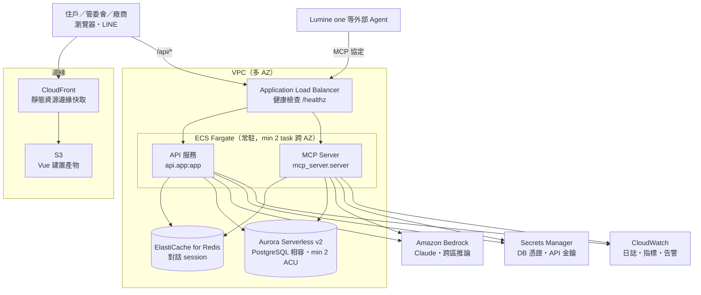

# 09・AWS 架構

> 建立日期：2026-07-27　狀態：**規格已定，尚未部署**
>
> 這份文件回答簡報必答的一題：**「為什麼你的 AWS 架構是這樣設計的？」**
>
> 決策基準見 [ADR-0018](../adr/0018-aws-sized-for-speed.md)：AWS 額度由主辦提供，
> 因此選型的目標函數是**評審操作時的體感延遲**，不是省成本。移植紀律仍依
> [ADR-0004](../adr/0004-local-first-aws-portable.md)：所有外部相依都藏在介面之後。

## 1. 一句話回答

**架構的每一個選擇，都對應到一段被消除的等待。**

| 使用者感受到的等待 | 造成它的選擇（不採用） | 我們的選擇 |
| --- | --- | --- |
| 打開網站的第一秒 | S3 靜態網站直出 | CloudFront 邊緣快取 |
| 送出第一個請求 | Lambda 冷啟動 | **ECS Fargate 常駐**（min 2 task） |
| 第一次查資料 | Aurora Serverless v2 從 0.5 ACU 暖機 | **最小 2 ACU** |
| AI 回應 | 跨太平洋呼叫地端模型 | **Bedrock（同區）** |
| 換一台機器就要重填表單 | 行程內記憶體存 session | **ElastiCache** |

## 2. 部署架構

## 3. 逐項理由（評審會問的就是這一節）

### 3.1 為什麼 ECS Fargate 而不是 Lambda？

命題的評分表寫著「使用體驗良好流暢」，且評委「以使用者的角度去體驗」。
Lambda 的冷啟動會落在**評審按下第一個按鈕的那一刻**——那正是第一印象。

- **常駐 task，最少 2 個跨 AZ**：沒有冷啟動，同時滿足可用性。
- 仍然容器化（見專案根目錄 `Dockerfile`），所以「改用 Lambda 容器映像」隨時做得到。
  這個可逆性是 ADR-0004 介面隔離換來的，不是碰巧。
- 若要壓成本，正確作法是 Lambda ＋ provisioned concurrency；但額度是主辦提供的，
  沒有理由拿體驗去換一筆我們不用付的錢。

### 3.2 為什麼 Aurora Serverless v2 最小 2 ACU？

ACU 0.5 起步時第一個查詢要等暖機。資料量小、連線少，但**延遲看得見**。
選 Postgres 相容是 ADR-0004 的硬約束：官方 DDL 就是 Postgres，
地端 SQLite 也刻意只用通用 SQL，不用任何專屬語法。

### 3.3 為什麼需要 ElastiCache？

因為選了常駐多 task，就一定不只一個執行單元。
對話 session 若留在行程內記憶體，同一個使用者的第二句話打到另一台就會
「工作階段不存在」——**這不是理論問題，是 3.1 那個決定的直接後果**。

程式面已經處理完：`core/sessions` 定義 `SessionStore` 介面，
`ConversationState` 只放可序列化資料，地端用行程內實作、雲端換 Redis 實作，
`api/app.py` 一行都不用改。測試以「JSON 往返」的假實作把關這條線不會退化。

### 3.4 為什麼 Bedrock 而不是繼續用地端模型？

目前地端接的是國網中心的 Gemma（OpenAI 相容端點）。上雲後改 Bedrock 的理由有三：

1. **延遲**：同區呼叫，省掉跨境往返。
2. **品質**：規劃器的拆解品質直接決定「Agent 像不像樣」；實測 Gemma 需要把
   服務代碼與列舉值都餵進提示詞才不會猜錯（見 `agent/planner.py` 的註解）。
3. **一致性**：這是 AWS 的競賽，AI 能力用 AWS 的托管服務是自然的答案。

換模型只改 `LlmClient` 的實作（`core/clients/llm.py`），呼叫端完全不動。

### 3.5 MCP Server 怎麼部署？

依 [ADR-0017](../adr/0017-llm-plans-rules-execute.md)「能力即 MCP 工具」，
MCP server 與 API 共用同一份 `core.tools` 註冊表，因此**同一個映像、同一個 task 定義**，
只是入口指令不同。不需要為 MCP 另外維護一套部署。

外部 Agent（Lumine one）的身分目前由環境變數指定；上雲後改為由
API Gateway／ALB 前的 OIDC token 解出，`ToolContext` 的建構是唯一要改的地方。

### 3.6 安全與資料

- **官方資料表零修改**（ADR-0001/0009）：所有新功能都是外掛擴充表。
- **身分不由模型決定**：工具的 JSON Schema 裡沒有 `account_id` 這種參數，
  所以 LLM 或外部 Agent 都無法要求讀別人的資料（`core/tools/registry.py`）。
- **寫入動作一律先確認**（ADR-0008）：規劃器產生的寫入步驟停在待確認狀態，
  且執行端不信任前端回傳的步驟，會重新驗證。
- 憑證走 Secrets Manager，容器內不落地任何 `.env`（`core/config.py` 全面吃環境變數）。

## 4. 環境變數（部署契約）

| 變數 | 用途 | 雲端來源 |
| --- | --- | --- |
| `API_URL` / `API_KEY` / `MODEL` | LLM 端點 | Secrets Manager（改 Bedrock 後由 IAM 角色取代） |
| `INQUIRY_DB_PATH` / `GROUP_BUY_DB_PATH` | 資料儲存位置 | 換成 Aurora 連線字串 |
| `DATA_DIR` | 地端資料目錄 | 容器內 `/data`（雲端不再使用） |
| `DEMO_TODAY` | 固定的「今天」，讓相對日期可重現 | 任務環境變數 |
| `PORT` | 服務埠 | 任務定義 |
| `MCP_ACCOUNT_ID` / `MCP_ROLE` / `MCP_DISPLAY_NAME` | MCP 實例代表的身分 | 上雲後改由 OIDC token 解出 |

## 5. 尚未完成

- [ ] 實際部署（將於 AWS Learner Lab 進行）
- [ ] Aurora 版的 `InquiryRepository` 實作（目前只有 SQLite 實作）
- [ ] Redis 版的 `SessionStore` 實作（介面與測試已就緒）
- [ ] Bedrock 版的 `LlmClient` 實作（介面已就緒）
- [ ] IaC（CDK 或 Terraform）

**這一節刻意保留**：介面都已就緒、容器已可運行，但雲端實作尚未寫。
簡報時要說得出「哪些是已完成、哪些是設計完成待實作」，不要讓架構圖看起來像已上線。
